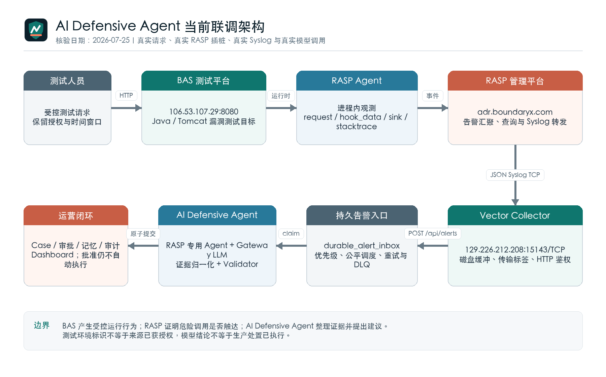
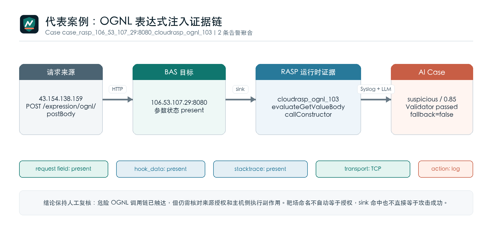

# AI Defensive Agent 安全运营研判系统

## 技术架构、联调实况与阶段评审

版本：1.0<br>
核验日期：2026-07-25<br>
适用范围：AI Defensive Agent、RASP 管理平台、BAS 测试平台联合验证环境

> 本文记录当前已经运行的系统、现场保留数据和代码实现。生产目标与现状分开表述，不以规划能力替代已完成能力。



## 1. 项目定位

AI Defensive Agent 位于安全产品与安全运营人员之间，负责接收告警、保留证据、组织 Case、调用产品专用分析 Agent、执行确定性校验，并把处置建议送入人工审批。它不替代 RASP、WAF、HIPS、NDR 或 SIEM，也不直接封禁、隔离、停用账号或修改生产策略。

当前项目的核心任务不是增加一个告警展示页面，而是把分散的安全事件变成可追溯的处置对象：原始日志、归一化事件、模型运行记录、验证结果、审批、记忆和审计都围绕同一 Case 建立关系。模型只负责受约束的分析，不拥有生产执行权限。

## 2. 三个平台的关系

| 组成 | 当前职责 | 输入 | 输出 | 责任边界 |
| --- | --- | --- | --- | --- |
| BAS 测试平台 | 提供可控的 Java/Tomcat 漏洞测试目标和接口 | 测试人员发起的受控 HTTP 请求 | 应用调用链、异常、文件/命令/JDBC/表达式等运行行为 | 产生验证流量，不承担告警研判 |
| RASP Agent 与管理平台 | 在应用进程内观测请求上下文、hook_data、危险 sink 和调用栈；管理平台汇聚事件 | BAS 应用运行时行为 | RASP 告警、规则、动作、调用栈和请求证据；Syslog 转发 | 证明运行时行为是否触达，不代替授权确认和主机侧结果审计 |
| AI Defensive Agent | 接入、归一化、聚合、分析、验证、审批与记忆治理 | RASP 及其他安全产品告警 | Case、证据维度、缺失项、处置建议、审批和审计记录 | 默认只读；批准仍不等于执行 |

当前联调链路如下：

1. 测试请求访问 BAS 平台 `106.53.107.29:8080` 上的受控接口。
2. 部署在 Java 应用内的 RASP Agent 记录请求路径、参数状态、hook_data、规则项和危险调用栈。
3. RASP 管理端 `https://adr.boundaryx.com/` 汇聚告警，并将 JSON Syslog 发送到 `129.226.212.208:15143/TCP`。
4. Vector Collector 接收 Syslog，补充传输元数据，经带鉴权的 HTTP 通道写入 Gateway。
5. Gateway 在返回 `202` 前将告警提交到持久队列，再由后台 Worker 完成分析。
6. RASP 专用 Agent 生成结构化结论；Validator 检查证据、输出契约、敏感信息、提示注入和动作权限。
7. Case、审批、记忆和审计进入 Dashboard。高影响动作只形成建议，执行状态固定为 `not_executed`。

这条链路中有三类地址不能混淆：告警中的 `src_ip` 是访问 BAS 的请求来源；`106.53.107.29:8080` 是测试目标；`129.226.212.208:15143` 是 Syslog 接收端。RASP 管理平台地址用于控制台访问与告警汇聚，不是 BAS 业务目标。

## 3. 当前运行架构

### 3.1 现网部署快照

2026-07-25 现场核验结果：

| 项目 | 当前状态 |
| --- | --- |
| 部署形态 | 单台 Ubuntu 主机上的 Docker Compose |
| Gateway | `defensive-ai-gateway-gateway-1`，健康；仅绑定 `127.0.0.1:8080` |
| Collector | Vector `0.46.1-alpine`，host network；五类产品端口均监听 TCP/UDP |
| HTTPS 边界 | systemd 管理的 Caddy，监听 80/443，反向代理到 Gateway |
| RASP 接入口 | `15143/TCP` 为当前推荐路径；`15143/UDP` 仅保留兼容 |
| 数据库 | SQLite，schema version 13，`PRAGMA integrity_check=ok` |
| 持久队列 | 当前 65 条 `completed`，无 pending/retry/processing/deferred/dead_letter |
| RASP 数据 | 101 条归一化 RASP 事件，31 个 RASP Case |
| LLM | Gateway 模式；每次 Agent Run 保存 provider、model、端点主机和 fallback 状态 |

Gateway 容器采用只读根文件系统、删除 Linux capabilities、`no-new-privileges`、独立角色 Token、资源上限和持久数据卷。Vector 使用非 root 用户运行，配置只读，缓冲目录单独持久化。Caddy 负责 TLS 和安全响应头。

当前证书适合隔离演示环境。正式环境应改用企业 CA 或可信公网证书，并按 RASP 管理端出口地址限制 `15143/TCP` 的网络访问。

### 3.2 网络与端口

| 端口 | 协议 | 用途 | 当前建议 |
| --- | --- | --- | --- |
| 443 | HTTPS | Dashboard 和 API | 对用户开放；使用角色 Token |
| 8080 | HTTP/loopback | Gateway 内部服务 | 不对公网开放 |
| 15140 | TCP/UDP | WAF Syslog | 正式接入优先 TCP |
| 15141 | TCP/UDP | HIPS Syslog | 正式接入优先 TCP |
| 15142 | TCP/UDP | NDR Syslog | 正式接入优先 TCP |
| 15143 | TCP/UDP | RASP Syslog | RASP 管理端使用 TCP；UDP 仅兼容 |
| 15144 | TCP/UDP | SIEM Syslog | 正式接入优先 TCP |

Vector 的 RASP 单帧上限为 2 MB，避免较长调用栈被默认 100 KiB 上限截断。TCP 事件记录 `collector_received_tcp`，只能证明 Collector 收到完整帧；它不能替代 RASP 管理端的发送确认。UDP 事件标记为 `legacy_udp_best_effort`，不能用于证明告警连续性。

### 3.3 告警处理链路

```text
RASP / WAF / HIPS / NDR / SIEM
        -> Vector Syslog Collector
        -> POST /api/alerts
        -> durable_alert_inbox
        -> priority and product-fair dispatcher
        -> bounded worker queue
        -> Normalizer and Case correlation
        -> Product Agent and remote LLM
        -> deterministic Validator
        -> Case / Approval / Memory / Audit
        -> Dashboard
```

HTTP 接口在 SQLite 提交成功后才返回 `202`。内存执行队列只保持与 Worker 数量相当的任务，Dispatcher 在 Worker 有空闲时才 claim，避免长时间排队的任务租约过期后被重复分析。处理期间续租，维护任务只回收真正失联的 claim。

持久入口同时按未完成条数、未完成原始字节数和磁盘剩余空间控制接入。默认单机配置为 20,000 条、1 GiB 未完成数据和 512 MiB 最低空闲空间。队列容量不足只影响告警入口，不把整个处置台从 readiness 中移除。

调度按 `critical/high/其他` 设置优先级，并在产品之间轮转，防止单一噪声源长期占用 Worker。五分钟反饥饿规则保证较低优先级告警最终仍能被处理。

### 3.4 LLM 失败与恢复

远程模型不可达、超时、429 和可恢复的 5xx 会进入 durable deferred/retry，由定时任务或 Dashboard 手工恢复。系统不会把远端模型失败静默替换成本地结论，避免同一 Case 在故障期间出现不同分析口径。

401、403、无效端点、WebSocket/Realtime 地址和响应契约错误属于配置性故障，直接进入终止性 DLQ，等待管理员修正后手工恢复，不进行无休止重试。重试退避包含抖动，避免网络恢复时形成同步重试洪峰。

### 3.5 RASP 数据合同与证据完整性

RASP 日志经过 `auto-rasp-json` 映射。系统保留完整原始告警，同时只把受控语义摘要发送给模型。两者职责如下：

| 数据层 | 保留内容 | 使用者 |
| --- | --- | --- |
| Raw Alert | 原始 RASP JSON、request_message、items、hook_data、stacktrace | 授权分析员、审计与回放 |
| Normalized Event | 规则、来源、目标、URL、方法、动作、sink、证据引用 | Case 关联、产品 Agent、Dashboard |
| Safe semantic evidence | 字段状态、字段名、长度、调用栈节点、规则摘要 | LLM 与 Validator |
| Evidence integrity | 原始/传输字节数、SHA-256、items 数、hook/stacktrace 数、TCP/UDP 标签 | 判断是否发生截断或上游缺失 |

请求字段使用 `present`、`empty`、`missing` 三种状态。`present` 表示上游已经提供，原始值仍在 Raw Alert 中；`empty` 表示上游提供了空值；`missing` 才表示源日志没有该字段。该设计解决了此前把“模型没有看到明文”误写成“Syslog 或网关丢失”的问题。

`items[]` 不只取第一项。每个规则项都形成受控摘要，记录 `rule_id`、动作、hook_data 状态和 stacktrace 状态。原始日志与 Collector 收到的消息分别计算字节数和 SHA-256，可在回放、重装和 Case 替换时核对证据身份。

### 3.6 Agent、Validator、审批与记忆

系统按产品选择 WAF、HIPS、NDR、RASP 或 SIEM Agent。RASP Agent 关注请求入口、污染源、危险 sink、规则匹配、hook_data、调用栈、RASP 动作和执行结果审计。BAS、`bastestground`、`cloudrasp-vulns` 或 `cn.rasp.vuln` 只作为环境线索，不能单独证明来源已获授权，也不能把高危行为改判为误报。

Validator 不调用 LLM。它检查：

- 分类和置信度是否满足结构化契约；
- 结论是否引用实际证据；
- 输出是否含提示注入、敏感信息或越权动作；
- Agent 是否越过 Skill 边界；
- 高风险建议是否需要审批。

同一 Case 聚合多条告警时，只展示最新处置轮次，历史审批折叠保留。处置措施先按“确认范围、遏制风险、保存证据、修复验证、恢复观察”排序，再统一编号，避免每条聚合告警生成一组重复审批。

记忆分为 Case 短期记忆、产品长期记忆、资产画像、组织知识和只读证据引用。长期记忆需要证据可追溯、人工批准、范围明确、设置过期时间且无敏感泄漏；命中运行时危险 sink 时，历史误报记忆具有否决限制，不能自动压低当前攻击信号。

## 4. RASP 真实联调情况

### 4.1 统计口径

当前数据库保留 101 条 RASP 归一化事件和 31 个 RASP Case。31 个 Case 中，14 个为 `critical`、17 个为 `high`；27 个为 `suspicious`、3 个为 `malicious`、1 个为 `insufficient_evidence`。全部 Case 仍处于 open，表示等待分析员完成业务授权核对或处置闭环，不代表数据未被处理。

这些记录包含现场投递、历史回放和重复验证，不能直接作为 101 次独立攻击或检出率分母。它们能够证明的是：真实 HTTP 请求进入 BAS，RASP 在 Java 运行时产生告警，Syslog 经 TCP 到达 Collector，Gateway 完成映射、聚合、模型分析和验证。

主要规则分布如下：

| 规则/类型 | 事件数 | 现场意义 |
| --- | ---: | --- |
| `cloudrasp_cmd_103` / 命令执行 | 25 | 验证外部输入是否触达 `ProcessBuilder` 等执行 sink |
| `cloudrasp_read_file_103` / 文件读取 | 17 | 验证文件路径输入与 `FileInputStream` 调用链 |
| `cloudrasp_read_file_102` / 文件读取 | 10 | 另一检测强度或规则路径的文件读取验证 |
| `cloudrasp_sql_connection_102` / JDBC | 9 | 验证 JDBC URL 与连接调用栈 |
| `cloudrasp_write_file_106` / 文件写入 | 6 | 验证文件落地行为与写入调用链 |
| JNI、类加载、JNDI、脚本引擎、反序列化、内存马、OGNL | 其余 | 覆盖多种 Java 高危运行时行为 |

### 4.2 代表案例一：OGNL 表达式注入

Case：`case_rasp_106_53_107_29:8080_cloudrasp_ognl_103`

| 证据 | 现场记录 |
| --- | --- |
| 来源与目标 | `43.154.138.159 -> 106.53.107.29:8080` |
| 请求 | `POST /expression/ognl/postBody` |
| 规则 | `cloudrasp_ognl_103` |
| 聚合 | 2 条告警进入同一 Case |
| 请求证据 | 参数状态为 present；原始值在 Raw Alert 中保留 |
| 危险调用 | `ognl.SimpleNode.evaluateGetValueBody`、`ognl.OgnlRuntime.callConstructor`、`ognl.ASTCtor.getValueBody` |
| RASP 动作 | `log` |
| 模型运行 | Gateway，`claude-sonnet-4-6`，`fallback_used=false` |
| 验证 | Validator `passed` |

该案例的价值在于确认了表达式从 HTTP 入口进入 OGNL 解析链并触达构造对象路径，比单纯匹配 URL 或 payload 关键字更接近实际漏洞可达性。最终结论保持“需人工复核”，原因是 RASP 动作为记录，且缺少来源授权记录和主机侧执行副作用；系统没有因为靶场命名就直接认定误报，也没有因为 sink 命中就夸大为已成功入侵。

### 4.3 代表案例二：命令执行聚合

Case：`case_rasp_106_53_107_29:8080_cloudrasp_cmd_103`

该 Case 聚合 7 条命令执行告警。请求为 `POST /cloudrasp-vulns/cmd/process_builder/postBody`，来源 `43.154.138.159`，RASP 调用栈命中 `java.lang.ProcessBuilder.start`，请求参数和 body 状态均为 present，hook_data 已提供受控语义字段。

这一案例同时验证两项产品能力：一是 RASP 能在应用运行时定位外部输入与危险 sink 的关系；二是 Agent 把 7 条同类告警收敛为一个处置对象，避免 7 组重复建议和审批。当前仍缺主机进程审计中的返回码、子进程及副作用，因此 Case 保持人工复核，不自动执行封禁或隔离。

### 4.4 代表案例三：JDBC 连接测试

Case：`case_rasp_106_53_107_29:8080_cloudrasp_sql_connection_102__b6d4b5d5a2`

4 条告警聚合到同一 Case，请求指向 `POST /bastestground/jdbc/postgres`。系统识别 JDBC 连接规则、调用栈和 hook_data 字段状态，并把原始 JDBC URL 留在受保护的 Raw Alert 中，仅向模型暴露字段语义和长度。这样既能判断连接参数是否具备风险，又避免把完整连接串送往外部模型。

### 4.5 代表案例四：最新 TCP 证据

最新两条 RASP 事件均通过 TCP 到达 Collector：

| 规则 | 请求 | 原始大小 | 证据状态 |
| --- | --- | ---: | --- |
| `cloudrasp_list_file_102` | `POST /bastestground/file/list/postJson` | 约 6.6 KiB | body present；hook_data 与 stacktrace 均存在；双哈希已记录 |
| `cloudrasp_webshell_101` | `GET /bastestground/webshell/godzilla.jsp` | 约 4.6 KiB | hook_data 与 stacktrace 均存在；GET body missing 符合请求形态；双哈希已记录 |

这两条记录说明“缺少请求体”必须结合 HTTP 方法和上游状态判断。GET 请求没有 body 不属于网关丢失；POST 事件则明确记录 body present。证据完整性字段使分析人员不再依靠模型措辞猜测传输是否完整。



## 5. 项目创新点

### 5.1 原始证据与模型上下文分层

完整日志留在本地事实库，模型只接收脱敏、限长、带状态的语义投影。系统既保留复核能力，又控制敏感数据外送范围。`present/empty/missing` 把“未提供”和“未展示明文”分开，直接降低误判。

### 5.2 证据连续性可核验

RASP 原始日志、Syslog 消息、items 数量、hook_data、stacktrace、字节数和 SHA-256 一起进入证据完整性记录。它不能证明发送端绝不丢包，但可以证明 Collector 收到后的数据是否完整，并为回放与替换 Case 提供身份校验。

### 5.3 概率分析与确定性门禁分离

产品 Agent 和 LLM负责分析，Validator 负责证据和权限门禁。两者不是同一个模型自问自答。提示注入、敏感输出、Skill 越界、分类契约和审批要求由确定性代码检查。

### 5.4 测试环境不自动等于授权

系统能识别 BAS 路由和 `cn.rasp.vuln` 调用栈，但只把它们放在“环境与授权线索”中。来源 IP 是否获批、测试窗口是否有效、行为是否产生副作用仍需独立证据。这一边界适合银行内网红蓝对抗、扫描平台和研发测试共存的环境。

### 5.5 LLM 故障期间保持分析口径

远端模型不可达时，告警进入持久队列等待恢复，不静默切换成本地判断。永久性配置错误直接进入 DLQ，避免反复消耗容量。恢复后按原告警身份继续处理，Case 回放可替换旧结论并保留审计关系。

### 5.6 记忆有生命周期和否决条件

误报经验不是直接写入提示词。它必须经过来源、范围、批准、过期和敏感信息检查；高危运行时证据可以否决历史误报相似度。这样能利用运营经验，同时降低记忆投毒和错误白名单扩散。

## 6. 安全控制与合规边界

| 风险 | 当前控制 | 尚需补充 |
| --- | --- | --- |
| 模型幻觉 | 证据引用、结构化契约、确定性 Validator、缺失证据清单 | 私有盲测集和定期质量评估 |
| 敏感数据外送 | 脱敏、语义投影、上下文限长、端点 allowlist | 企业 DLP、模型网关审计和数据分级策略 |
| 越权处置 | 默认只读、双人审批、`not_executed` 数据库约束 | IAM/SSO、工单和 SOAR 的签名回写 |
| 提示注入 | 字段清洗、检测线索、人工复核续转、记忆晋升门禁 | 面向厂商真实日志的对抗集 |
| 队列与模型故障 | 持久队列、优先级、公平调度、租约、重试抖动、DLQ | 多节点消息系统和跨机房容灾 |
| Syslog 丢失 | TCP 推荐、Vector 磁盘缓冲、2 MB RASP 帧、证据哈希 | 发送端确认、mTLS relay、Collector HA |
| 审计追溯 | Raw Alert、Event、Run、Validation、Approval、Memory、Audit 关联 | 企业留存策略、不可变存储和集中审计平台 |

## 7. 当前限制与生产化优先级

### P0：进入生产前必须完成

1. 将 SQLite 事实库迁移到 PostgreSQL；将告警流迁移到 Kafka/Redpanda 或 RabbitMQ，原始大日志进入对象存储。
2. 拆分 Gateway 接入层与分析 Worker，支持独立扩容；按租户、产品和 Case correlation key 分区。
3. 为 Syslog 建立双 Collector、高可用入口、发送端确认或 TLS relay，并移除 RASP UDP 兼容通道。
4. 接入企业 IAM/SSO、mTLS、证书生命周期、Secrets 管理和来源网络白名单。
5. 建立容量压测、故障注入、备份恢复和跨节点演练基线。

### P1：生产试点期间完成

1. 建设正式 Golden Set，按产品、攻击类型、误报和证据缺口做盲测。
2. 增加接收率、完成率、最老等待时间、LLM P95、永久/瞬时错误、磁盘水位、Vector 缓冲和每产品积压指标。
3. 接入 CMDB、资产分级、变更窗口、扫描授权和主机审计，缩小“需人工复核”比例。
4. 把审批对接工单和 SOAR，但保留职责分离、回滚条件和执行回写。

### P2：规模化运营阶段

1. 建设跨产品攻击链图和实体关系服务。
2. 使用企业 Embedding/pgvector 替换 Demo 哈希向量，并实施漂移、冲突和过期治理。
3. 建立模型成本、租户配额、提示词发布、回放对比和变更审批制度。

## 8. 演示与验收建议

现场演示应使用一条新生成的 RASP 测试告警，完整展示以下证据：

1. RASP 管理端发送到 `129.226.212.208:15143/TCP`；
2. Dashboard 队列从 pending/processing 进入 completed；
3. Case 标题显示攻击类型、源、目标和入口；
4. 详情同时展示 request、hook_data、stacktrace 和 evidence integrity；
5. 模型运行记录显示 Gateway、模型名和 `fallback_used=false`；
6. Validator 状态为 passed/review/blocked 之一，并能解释原因；
7. 多条同类告警只产生一个当前处置轮次；
8. 审批完成后仍显示未执行；
9. 断开 LLM 后告警进入 deferred，恢复后由定时或手工任务继续处理；
10. 401/403 配置错误进入 DLQ，不被无限重试。

## 9. 结论

当前项目已经完成从“单条告警问答”到“受治理的安全运营工作流”的关键转变。RASP 与 BAS 的联调证明，系统能够接收真实运行时告警，保留 request、hook_data 和调用栈证据，并把多条同类事件整理成可复核 Case。AI Defensive Agent 的价值集中在证据整理、分析一致性、缺口识别、审批收敛和经验治理，而不是替代安全产品或直接执行生产动作。

现有单机部署适合阶段演示、规则联调和小规模 PoC。生产化的主要工作已从功能补齐转向高可用数据底座、企业身份与处置系统集成、端到端传输保障和真实盲测质量基线。

## 附录 A：当前代表 Case

| Case ID | 类型 | 聚合告警 |
| --- | --- | ---: |
| `case_rasp_106_53_107_29:8080_cloudrasp_ognl_103` | OGNL 表达式注入 | 2 |
| `case_rasp_106_53_107_29:8080_cloudrasp_cmd_103` | 命令执行 | 7 |
| `case_rasp_106_53_107_29:8080_cloudrasp_sql_connection_102__b6d4b5d5a2` | JDBC 连接 | 4 |
| `case_rasp_106_53_107_29:8080_cloudrasp_webshell_101` | WebShell 特征 | 1 |
| `case_rasp_106_53_107_29:8080_cloudrasp_jni_102__c6b57ed70b` | JNI 加载 | 1 |
| `case_rasp_VM-0-7-centos_cloudrasp_classloader_102` | 恶意类加载 | 1 |

## 附录 B：核验边界

- 现场统计来自 2026-07-25 远端运行数据库，后续新增、删除或重新处置会改变数量。
- 文中的“真实联调”表示真实请求、真实 RASP 插桩、真实 Syslog 和真实模型调用链；不等同于确认来源未经授权。
- 当前数据没有提供完整 BAS 资产清单、RASP 管理端内部拓扑、企业 IAM、工单或 SOAR 回写，因此未把这些能力写成已完成。
