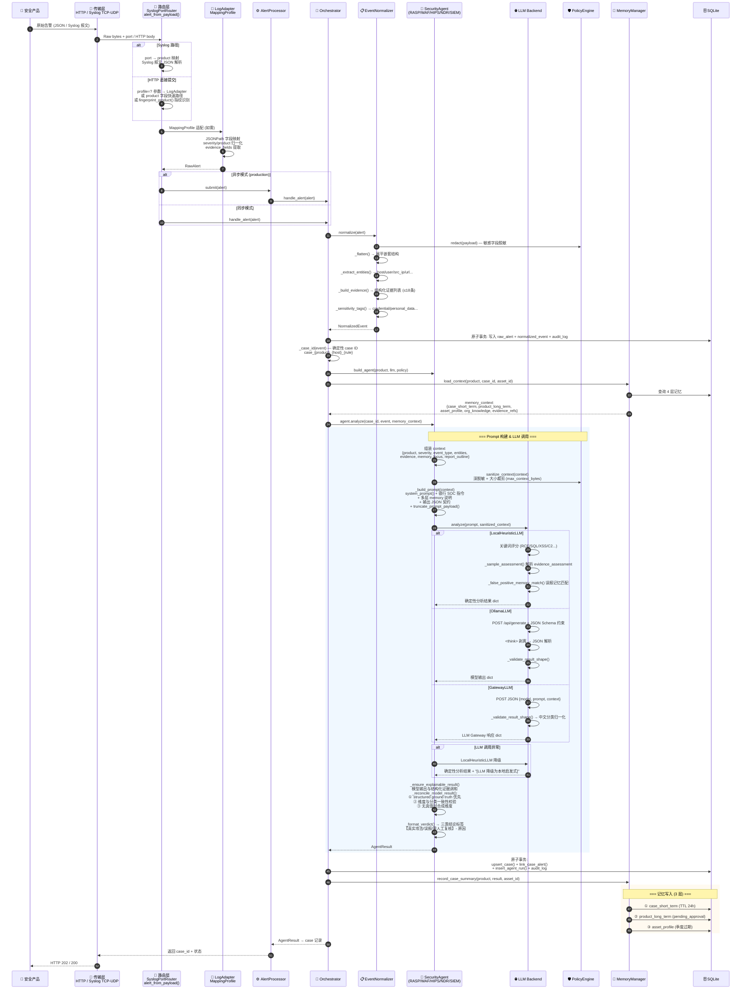
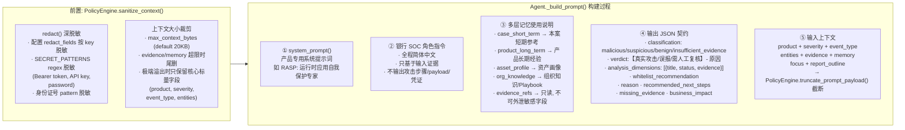
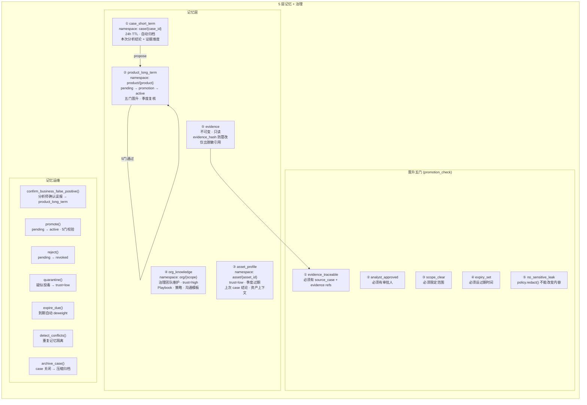

# Defensive AI Gateway — 完整架构图

```mermaid
flowchart TB
    %% ═══════════════════════════════════════════════════════════════
    %% 1) 告警输入层 — 三大入口
    %% ═══════════════════════════════════════════════════════════════

    subgraph INPUT["🔔 告警输入层"]
        direction LR
        WAF_DEV["WAF 设备<br/>JSON/Syslog"]
        HIPS_DEV["HIPS 设备<br/>JSON/Syslog"]
        NDR_DEV["NDR 设备<br/>JSON/Syslog"]
        RASP_DEV["RASP 设备<br/>JSON/Syslog"]
        SIEM_DEV["SIEM 平台<br/>JSON/Syslog"]
        DEMO["Demo 样本<br/>sample_alerts.py"]
    end

    %% ═══════════════════════════════════════════════════════════════
    %% 2) 传输与路由层
    %% ═══════════════════════════════════════════════════════════════

    subgraph TRANSPORT["📡 传输层 (app.py / syslog_receiver.py)"]
        direction TB

        subgraph SYSLOG["Syslog TCP/UDP 接收器"]
            SRM["SyslogReceiverManager<br/>per-product listener<br/>15140 WAF · 15141 HIPS<br/>15142 NDR · 15143 RASP<br/>15144 SIEM"]
        end

        subgraph HTTP["HTTP REST API"]
            HTTP_HANDLER["GatewayHandler<br/>POST /api/alerts<br/>GET /api/health ..."]
        end
    end

    subgraph ROUTE["🔀 路由 & 识别层 (syslog_router.py / app.py:alert_from_payload)"]
        direction TB
        SPR["SyslogPortRouter<br/>port → product 映射<br/>+ Syslog 报文 JSON 解析"]
        AFP["alert_from_payload()<br/>1. 显式 profile=? 参数 → LogAdapter<br/>2. 显式 product 字段 → 快速路径<br/>3. fingerprint_product() 指纹识别<br/>4. 标准告警启发式 → 兜底 siem"]
    end

    %% ═══════════════════════════════════════════════════════════════
    %% 3) 日志适配层
    %% ═══════════════════════════════════════════════════════════════

    subgraph ADAPTER["🔄 日志适配层 (log_adapter.py)"]
        direction TB
        LA["LogAdapter"]
        MP["MappingProfile<br/>JSONPath 映射规则<br/>$.rule.id → rule_id<br/>$.items[0].attack_type → event_type<br/>transform: rasp_sink_from_stacktrace …"]
        INFER["infer_mapping_profile()<br/>自动字段识别<br/>+ 候选路径排序"]
        DRY["dry_run()<br/>映射预览 / 验证"]
        AUTO["AUTO_PROFILE<br/>指纹命中 → 自动套用<br/>如 cloudrasp → auto-rasp-json"]
    end

    %% ═══════════════════════════════════════════════════════════════
    %% 4) 异步处理队列
    %% ═══════════════════════════════════════════════════════════════

    subgraph QUEUE["⚙️ 异步处理队列 (processing.py)"]
        direction LR
        AP["AlertProcessor<br/>bounded queue (max=5000)<br/>worker pool (default=4)<br/>submit() / start() / stop()"]
        STATS["AlertProcessorStats<br/>submitted / processed<br/>failed / rejected / inflight"]
    end

    %% ═══════════════════════════════════════════════════════════════
    %% 5) 核心编排引擎
    %% ═══════════════════════════════════════════════════════════════

    subgraph ORCH["🧠 Orchestrator (orchestrator.py)"]
        direction TB
        O["Orchestrator.handle_alert(alert)"]
        step1["① EventNormalizer.normalize(alert) → NormalizedEvent"]
        step2["② 原子事务写入: audit_log + raw_alerts + normalized_events"]
        step3["③ case_id = _case_id(event) 确定性哈希"]
        step4["④ build_agent(product, llm, policy)→SecurityAgent"]
        step5["⑤ memory.load_context(product, case_id, asset_id)"]
        step6["⑥ agent.analyze(case_id, event, memory_context)→AgentResult"]
        step7["⑦ 原子事务: upsert_case + link_case_alert + insert_agent_run + record_case_summary + audit"]
        step8["⑧ LLM 失败降级: LocalHeuristicLLM fallback"]
        O --> step1 --> step2 --> step3 --> step4 --> step5 --> step6 --> step7
        O -.-> step8
    end

    %% ═══════════════════════════════════════════════════════════════
    %% 6) Agent 层 — 五个产品专用 Agent
    %% ═══════════════════════════════════════════════════════════════

    subgraph AGENTS["🤖 Agent 层 (agents/)"]
        direction TB
        BASE["SecurityAgent (ABC) 基类<br/>┣ system_prompt() — 产品专用系统提示词<br/>┣ analysis_focus() — 分析关注点<br/>┣ report_outline() — 报告结构<br/>┣ _build_prompt() — 构建完整 prompt<br/>┣ _ensure_explainable_result() — LLM 结果调和<br/>┗ _reconcile_model_result() — 模型输出校验"]

        subgraph CONCRETE["5 个产品 Agent"]
            RA["RaspAgent<br/>SQL注入·JNDI·命令执行<br/>→ system_prompt_rasp()"]
            WA["WafAgent<br/>SQLi·XSS·路径穿越·协议异常<br/>→ system_prompt_waf()"]
            HA["HipsAgent<br/>进程链·凭证访问·横向移动<br/>→ system_prompt_hips()"]
            NA["NdrAgent<br/>C2 beacon·外传·TLS指纹<br/>→ system_prompt_ndr()"]
            SA["SiemAgent<br/>多源关联·攻击链·时间线<br/>→ system_prompt_siem()"]
        end

        REG["registry.py<br/>build_agent(product) → agent<br/>AGENT_TYPES map<br/>未知 product → SiemAgent 兜底"]

        EVID["evidence_helpers.py<br/>fact() / join_facts()<br/>normalize_classification()<br/>short_text() / strip_terminal()"]
    end

    BASE --> CONCRETE
    REG --> CONCRETE

    %% ═══════════════════════════════════════════════════════════════
    %% 7) LLM 后端层 — 三套后端
    %% ═══════════════════════════════════════════════════════════════

    subgraph LLM["🌐 LLM 后端 (llm.py / policy.py)"]
        direction TB

        subgraph LLM_BACKENDS["LLMClient 抽象 → 3 个后端"]
            LOCAL["LocalHeuristicLLM<br/>确定性规则分析器<br/>关键词评分 + 样本 evidence_assessment 解析<br/>+ 误报记忆匹配 _false_positive_memory_match()<br/>is_deterministic = True"]
            OLLAMA["OllamaLLM<br/>本地 Ollama 模型 (gemma3:4b…)<br/>JSON Schema 约束输出<br/>(OLLAMA_ANALYSIS_SCHEMA)<br/>temperature=0, fixed seed"]
            GW_LLM["GatewayLLM<br/>企业内网 LLM Gateway<br/>JSON-over-HTTP 适配<br/>_validate_result_shape()<br/>中文分类标签归一化"]
        end

        PE["PolicyEngine<br/>← 上下文必经的单一掐点<br/>┣ redact() — 敏感字段/模式脱敏<br/>┣ sanitize_context() — 大小裁剪 + 脱敏<br/>┣ truncate_prompt_payload() — Prompt 截断<br/>┗ action_mode() — 只读/审批/自动 模式判定"]
    end

    %% ═══════════════════════════════════════════════════════════════
    %% 8) 多层记忆系统
    %% ═══════════════════════════════════════════════════════════════

    subgraph MEMORY["🧩 多层记忆系统 (memory.py)"]
        direction TB
        MM["MemoryManager"]
        L1["① case_short_term<br/>namespace: case/{case_id}<br/>自动归档 24h TTL<br/>status: active → expired"]
        L2["② product_long_term<br/>namespace: product/{product}<br/>pending_approval → 5门晋升<br/>季度复核 · 自动过期 · 冲突检测"]
        L3["③ asset_profile<br/>namespace: asset/{asset_id}<br/>低信任运营上下文<br/>季度过期"]
        L4["④ org_knowledge<br/>namespace: org/{scope}<br/>治理团队维护<br/>Playbook · 策略 · 沟通模板<br/>只读默认值自动播种"]
        L5["⑤ evidence<br/>不可变证据引用<br/>read-only · desensitized<br/>load_evidence_refs()"]

        GOV["记忆治理 (Governance)"]
        PROMO["5-Gate 晋升规则<br/>① evidence_traceable<br/>② analyst_approved<br/>③ scope_clear<br/>④ expiry_set<br/>⑤ no_sensitive_leak"]
        OPS["运维操作<br/>promote() · reject() · quarantine()<br/>expire_due() · detect_conflicts()<br/>archive_case() · review_overdue()<br/>confirm_business_false_positive()"]
    end

    %% ═══════════════════════════════════════════════════════════════
    %% 9) 持久化层
    %% ═══════════════════════════════════════════════════════════════

    subgraph DB["🗄️ Repository / SQLite (database.py)"]
        direction LR
        subgraph TABLES["核心表"]
            T_RA["raw_alerts"]
            T_NE["normalized_events<br/>(evidence_hash 防篡改)"]
            T_CS["cases"]
            T_AR["agent_runs"]
            T_CAL["case_alert_links"]
            T_ME["memory_entries<br/>(5层 memory)"]
            T_MEV["memory_events<br/>(审计追踪)"]
            T_AUDIT["audit_log"]
            T_MP["mapping_profiles"]
        end
        TX["_Transaction 上下文管理器<br/>可重入 · 原子提交/回滚<br/>RLock 串行化并发"]
    end

    %% ═══════════════════════════════════════════════════════════════
    %% 10) Dashboard + API
    %% ═══════════════════════════════════════════════════════════════

    subgraph UI["🖥️ Dashboard & API"]
        direction TB
        DASH["static/index.html<br/>Cases · Alerts · Memory<br/>LLM Config · Syslog Config<br/>Mapping Profiles"]
        API_ROUTES["REST API<br/>┣ /api/alerts — 告警提交<br/>┣ /api/cases — Case 列表/详情/处置<br/>┣ /api/memory — 记忆查询/晋升/拒绝/隔离/sweep<br/>┣ /api/memory/events — 记忆事件<br/>┣ /api/config/llm — LLM 配置 CRUD + reload + Ollama 模型列表<br/>┣ /api/config/syslog — Syslog 端口协议配置<br/>┣ /api/mapping-profiles — 日志适配配置<br/>┣ /api/mapping-profiles/dry-run — 适配预览<br/>┣ /api/mapping-profiles/infer — 自动字段识别<br/>┣ /api/alerts/{id}/confirm-false-positive — 人工确认误报<br/>┗ /api/health — 健康检查 + 统计"]
    end

    %% ═══════════════════════════════════════════════════════════════
    %% 11) 配置层
    %% ═══════════════════════════════════════════════════════════════

    subgraph CONFIG["⚙️ 配置 (config.py)"]
        direction LR
        CFG["GatewayConfig<br/>┣ ServerConfig (host/port)<br/>┣ DatabaseConfig (path)<br/>┣ LLMConfig (provider/endpoint/model/api_key/timeout)<br/>┣ PolicyConfig (mode/max_prompt/max_context/redact_fields)<br/>┣ AuthConfig (api_token/loopback/remote)<br/>┣ ProcessingConfig (async/queue/workers)<br/>┗ SyslogConfig (product_ports/protocols/profiles)"]
        YAML["config/dev.yaml<br/>config/prod.example.yaml<br/>+ parse_simple_yaml()<br/>+ 环境变量覆盖"]
    end

    %% ═══════════════════════════════════════════════════════════════
    %% 12) 外围脚本
    %% ═══════════════════════════════════════════════════════════════

    subgraph SCRIPTS["🔧 脚本 (scripts/)"]
        direction LR
        SEND["send_demo_alerts.py<br/>send_sample.py"]
        SIM["simulate_syslog_ports.py"]
        RESET["reset_and_seed_alerts.py<br/>clean_alerts_and_memory.py"]
        HARNESS["run_harness.py"]
    end

    %% ═══════════════════════════════════════════════════════════════
    %% 连接线
    %% ═══════════════════════════════════════════════════════════════

    WAF_DEV --> SYSLOG
    HIPS_DEV --> SYSLOG
    NDR_DEV --> SYSLOG
    RASP_DEV --> SYSLOG
    SIEM_DEV --> SYSLOG
    DEMO --> HTTP

    SYSLOG --> SPR
    HTTP --> AFP

    SPR --> AFP
    AFP --> LA
    LA --> MP
    LA --> INFER
    LA --> DRY
    LA -.-> AUTO

    AFP --> QUEUE
    QUEUE --> ORCH

    ORCH --> AGENTS
    ORCH --> MEMORY
    AGENTS --> LLM
    LLM --> PE
    MEMORY --> DB

    ORCH --> DB
    AGENTS --> DB
    MEMORY --> DB

    UI --> HTTP_HANDLER
    UI --> API_ROUTES
    SCRIPTS --> HTTP

    CONFIG --> ORCH
    CONFIG --> LLM
    CONFIG --> DB
    CONFIG --> QUEUE
    CONFIG --> MEMORY
```



---

## 数据流全景（单条告警的完整生命周期）



---

## LLM Prompt 构建详细流程



---

## 多层记忆架构



---

## Agent 注册与分发

```mermaid
flowchart LR
    ORCH[Orchestrator] -->|event.product| BUILD[build_agent()]
    BUILD --> REG{AGENT_TYPES map}

    REG -->|"hips"| HIPS[HipsAgent]
    REG -->|"rasp"| RASP[RaspAgent]
    REG -->|"ndr"| NDR[NdrAgent]
    REG -->|"waf"| WAF[WafAgent]
    REG -->|"siem" 或未知| SIEM[SiemAgent]

    HIPS --> BASE[SecurityAgent ABC]
    RASP --> BASE
    NDR --> BASE
    WAF --> BASE
    SIEM --> BASE

    BASE --> LLM[LLMClient]
    BASE --> POL[PolicyEngine]

    subgraph DIFF["各 Agent 差异点"]
        direction TB
        SYS["system_prompt() — 产品知识注入"]
        FOCUS["analysis_focus() — 分析关注点列表"]
        OUTLINE["report_outline() — 报告章节标题"]
    end
```

---

## 核心模块速查表

| 模块 | 文件 | 职责 |
|------|------|------|
| **入口** | `__main__.py` | 启动 HTTP 服务器 |
| **HTTP 服务** | `app.py` | REST API + Dashboard 静态文件 + 告警接收/路由 |
| **编排引擎** | `orchestrator.py` | `handle_alert()` 主流程：归一化 → Agent分析 → 记忆写入 |
| **配置** | `config.py` | YAML 解析 + 环境变量覆盖 + 7 个子配置 |
| **数据模型** | `models.py` | RawAlert, NormalizedEvent, AgentResult, RecommendedAction |
| **数据库** | `database.py` | SQLite WAL + `Repository` + `_Transaction` 原子事务 |
| **LLM 后端** | `llm.py` | 3 套后端 + JSON Schema 约束 + 结果校验 |
| **策略引擎** | `policy.py` | 敏感字段脱敏 · 上下文裁剪 · 动作模式 · prompt 截断 |
| **归一化器** | `normalizer.py` | 原始告警 → NormalizedEvent (实体提取 + 证据构建 + 敏感标签) |
| **异步队列** | `processing.py` | 有界 worker pool 解耦接收与分析 |
| **系统日志** | `syslog_receiver.py` | TCP/UDP 多产品监听器管理 |
| **Syslog路由** | `syslog_router.py` | 端口 → 产品映射 + JSON 解析 |
| **日志适配** | `log_adapter.py` | MappingProfile · LogAdapter · 字段推断 · 自动适配 |
| **记忆管理** | `memory.py` | 5层记忆 · 晋升 · 治理 · 过期 · 误报确认 |
| **Agent 基类** | `agents/base.py` | SecurityAgent ABC · prompt构建 · 结果调和 · 综合降级 |
| **Agent 注册** | `agents/registry.py` | `build_agent()` · AGENT_TYPES 映射 |
| **5个Agent** | `agents/{rasp,waf,hips,ndr,siem}.py` | 产品专用 system_prompt + analysis_focus |
| **证据助手** | `agents/evidence_helpers.py` | fact/join_facts/normalize_classification 工具函数 |
| **样本生成** | `sample_alerts.py` | 5产品 × 3场景(attack/fp/suspicious) 随机样本 |
