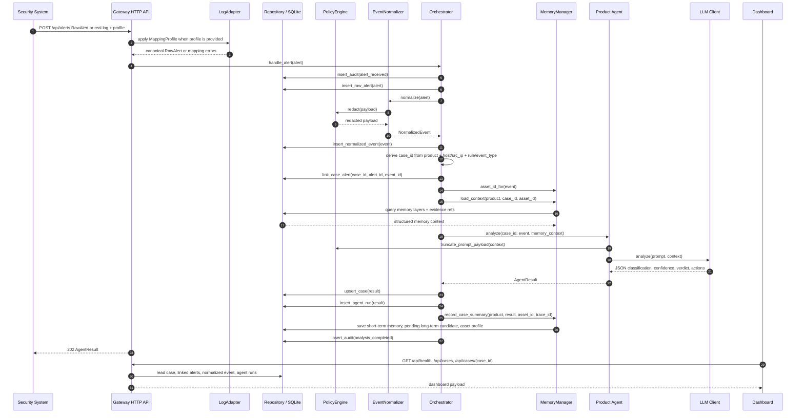
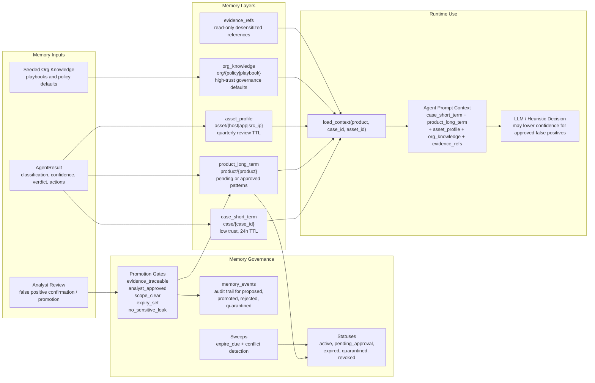
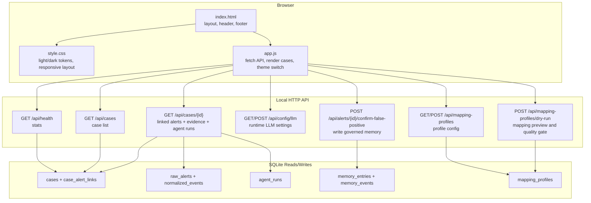
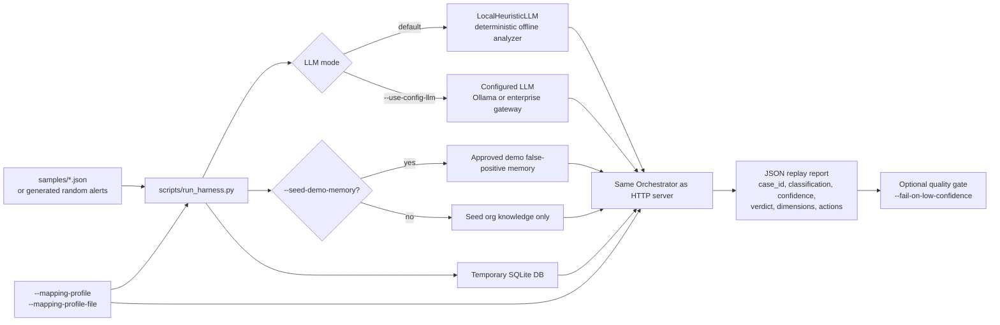
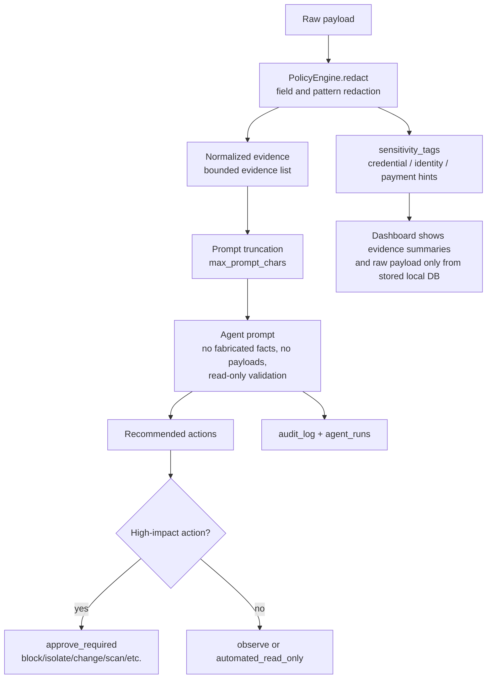

# Defensive AI Gateway Demo Architecture

This demo is a dependency-light defensive AI gateway for bank security operations.
It receives alerts from security systems, normalizes and redacts them, enriches
analysis with governed memory, sends the case to a product-specific security
agent, persists the full trace to SQLite, and exposes the result through a local
dashboard and replay harness.

## Component Architecture

```mermaid
flowchart TB
  subgraph Sources["Security Systems"]
    HIPS["HIPS\nHost intrusion / process behavior"]
    RASP["RASP\nRuntime app protection"]
    NDR["NDR\nNetwork detection"]
    WAF["WAF\nWeb attack detection"]
    SIEM["SIEM\nCorrelated incident cases"]
    Samples["Sample Alerts\nsamples/*.json"]
  end

  subgraph Entry["Entry Points"]
    AlertsAPI["HTTP API\nPOST /api/alerts"]
    MappingAPI["Mapping Profile API\n/api/mapping-profiles + dry-run"]
    DashboardAPI["Dashboard API\n/api/health /api/cases /api/config/llm"]
    Harness["Replay Harness\nscripts/run_harness.py"]
    Dashboard["Static Dashboard\nindex.html + app.js + style.css"]
  end

  subgraph Gateway["Gateway Runtime"]
    App["GatewayState + GatewayHandler\nthreaded local HTTP server"]
    Config["GatewayConfig\nserver / database / policy / LLM"]
    Policy["PolicyEngine\nredaction, prompt limits, approval mode"]
    Adapter["LogAdapter\nprofile-based field mapping, validation, dry-run"]
    Normalizer["EventNormalizer\nentities, evidence, sensitivity tags"]
    Orchestrator["Orchestrator\ncase linking, agent routing, trace"]
    Registry["Agent Registry\nproduct -> agent"]
  end

  subgraph Agents["Product-Specific Security Agents"]
    HipsAgent["HIPS Agent"]
    RaspAgent["RASP Agent"]
    NdrAgent["NDR Agent"]
    WafAgent["WAF Agent"]
    SiemAgent["SIEM Agent"]
    BaseAgent["SecurityAgent Base\nprompt contract + explainability fallback"]
  end

  subgraph Intelligence["Intelligence Layer"]
    Memory["MemoryManager\nmulti-layer governed memory"]
    LLM["LLM Client\nLocalHeuristicLLM / Ollama / Enterprise Gateway"]
  end

  subgraph Store["SQLite Fact Store"]
    Raw["raw_alerts"]
    Events["normalized_events"]
    Cases["cases"]
    Runs["agent_runs"]
    Links["case_alert_links"]
    Mem["memory_entries"]
    MemEvents["memory_events"]
    Audit["audit_log"]
    Profiles["mapping_profiles"]
  end

  HIPS --> AlertsAPI
  RASP --> AlertsAPI
  NDR --> AlertsAPI
  WAF --> AlertsAPI
  SIEM --> AlertsAPI
  Samples --> Harness

  AlertsAPI --> App
  MappingAPI --> App
  Dashboard --> DashboardAPI
  DashboardAPI --> App
  Harness --> Config
  Harness --> Policy
  Harness --> Normalizer
  Harness --> Orchestrator

  App --> Config
  App --> Policy
  App --> Adapter
  App --> Normalizer
  App --> Memory
  App --> LLM
  App --> Orchestrator

  Orchestrator --> Raw
  Adapter --> Raw
  Orchestrator --> Normalizer
  Normalizer --> Events
  Orchestrator --> Links
  Orchestrator --> Registry
  Registry --> HipsAgent
  Registry --> RaspAgent
  Registry --> NdrAgent
  Registry --> WafAgent
  Registry --> SiemAgent
  HipsAgent --> BaseAgent
  RaspAgent --> BaseAgent
  NdrAgent --> BaseAgent
  WafAgent --> BaseAgent
  SiemAgent --> BaseAgent

  Orchestrator --> Memory
  Memory <--> Mem
  Memory --> MemEvents
  BaseAgent --> Policy
  BaseAgent --> LLM
  LLM --> BaseAgent
  Orchestrator --> Cases
  Orchestrator --> Runs
  Orchestrator --> Audit
  DashboardAPI --> Raw
  DashboardAPI --> Events
  DashboardAPI --> Cases
  DashboardAPI --> Runs
  DashboardAPI --> Links
  DashboardAPI --> Mem
  MappingAPI --> Profiles
  Adapter --> Profiles
```

## Alert Processing Sequence

## Memory Model

The memory system is intentionally governed. Agents can read sanitized memory
context, but long-term operational memory is not automatically trusted. New
observations are written as short-term case memory and proposed long-term
candidates. Promotion requires explicit gates.

### Memory Layer Responsibilities

| Layer | Purpose | Trust / Lifecycle | Main Namespace |
| --- | --- | --- | --- |
| `case_short_term` | Current case observation and explainable summary | Low trust, auto-expires after 24h | `case/{case_id}` |
| `product_long_term` | Reusable product-specific patterns, including approved false positives | Pending until promoted; active entries need scope and expiry | `product/{product}` |
| `asset_profile` | Recent asset behavior and last verdict for host/app/source IP | Low trust, quarterly review TTL | `asset/{asset_id}` |
| `org_knowledge` | Playbooks, incident grading, approval chain, communication templates | High trust, governance-maintained defaults | `org/{scope}` |
| `evidence_refs` | Immutable, desensitized evidence references for a case | Read-only to agents | case-linked evidence |

## Dashboard Architecture

The dashboard is deliberately static. There is no build step, no npm dependency,
and no client-side framework. This keeps the demo easy to migrate into an offline
or tightly controlled environment.

The adapter page lets an operator edit a Mapping Profile, paste one sanitized
real log, and run dry-run. Dry-run shows mapping errors, the canonical `RawAlert`,
and the `NormalizedEvent` that would reach the agent. Formal analysis should only
be enabled for profiles that pass this preview gate.

## Harness Architecture

The harness is important because it exercises the same runtime path as the HTTP
server while staying deterministic by default. It is the quickest way to validate
new samples, prompt behavior, memory effects, and confidence thresholds before
running a live dashboard demo.

## Database Role

SQLite is the demo fact store. It is not just a cache for the dashboard; it is the
audit and replay backbone.

| Table | Role |
| --- | --- |
| `raw_alerts` | Original alert metadata and JSON payload from the security product |
| `normalized_events` | Redacted, normalized entities, evidence, and sensitivity tags |
| `cases` | Current case status, severity, classification, confidence, and summary |
| `case_alert_links` | Many-alert-to-case linkage |
| `agent_runs` | Full agent output per run, including prompt version and product |
| `memory_entries` | Governed memory objects across all memory layers |
| `memory_events` | Memory lifecycle audit events |
| `memory_matches` | Auditable alert-to-memory candidate scores, ranking, decision, and final effect |
| `audit_log` | Gateway and agent trace events |

## LLM and Agent Contract

The agent layer hides product-specific analysis behind a common contract:

1. Build structured context from normalized evidence and governed memory.
2. Create a prompt that forbids invented facts, exploit payloads, and credential
   leakage.
3. Ask the configured LLM client for strict JSON.
4. Normalize classification, confidence, explanation dimensions, missing evidence,
   and recommended actions.
5. Apply safety policy to recommended actions so high-impact operations remain
   `approve_required`.

Supported LLM modes:

| Mode | Use |
| --- | --- |
| `LocalHeuristicLLM` | Deterministic local analyzer for offline MVP, tests, and harness |
| `ollama` | Local model endpoint for development demos |
| `gateway` | Enterprise LLM gateway endpoint with API key/env configuration |

## Security Controls

Key security design points:

- Raw alerts are stored locally, but prompt input is redacted and truncated.
- Agents receive evidence summaries and memory context, not open-ended tool access.
- Recommended response actions are advisory by default.
- Destructive actions such as block, isolate, change, disable, scan, or exploit are
  converted to approval-required actions.
- Memory promotion is gated to reduce memory poisoning and stale false-positive
  patterns.
- Every alert receipt, analysis completion, agent run, and memory lifecycle event
  is auditable.

## End-to-End Demo Narrative

1. A security product or sample script submits a HIPS/RASP/NDR/WAF/SIEM alert.
2. The gateway writes the raw alert, redacts sensitive fields, extracts entities,
   and builds normalized evidence.
3. The orchestrator deterministically maps the event to a case and links all
   related alert/event IDs.
4. The memory manager loads short-term case context, approved/pending product
   memory, asset profile, org playbooks, and evidence refs.
5. The product agent builds a constrained prompt and calls the configured LLM.
6. The result is persisted as a case and an agent run, then summarized back into
   governed memory.
7. The dashboard reads health stats, case lists, linked alerts, normalized evidence,
   agent runs, and LLM config through local APIs.
8. The harness can replay the same path offline with temporary SQLite storage and
   deterministic LLM behavior for validation.
