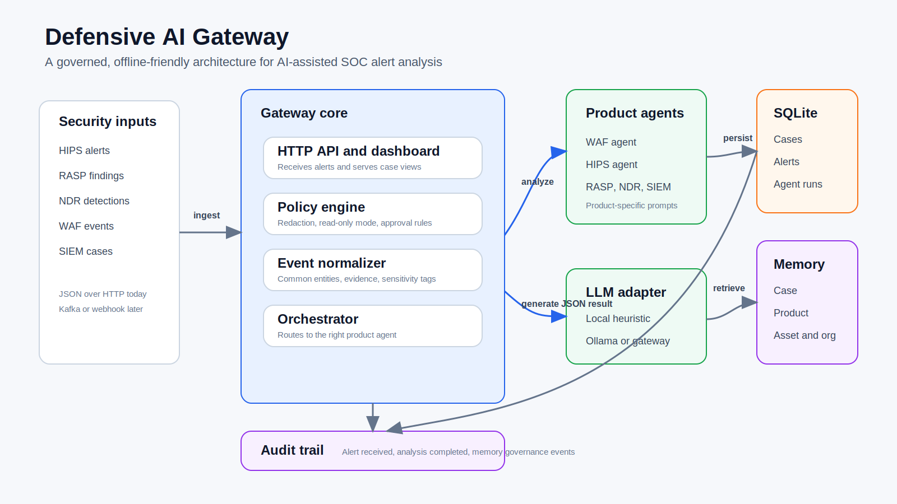
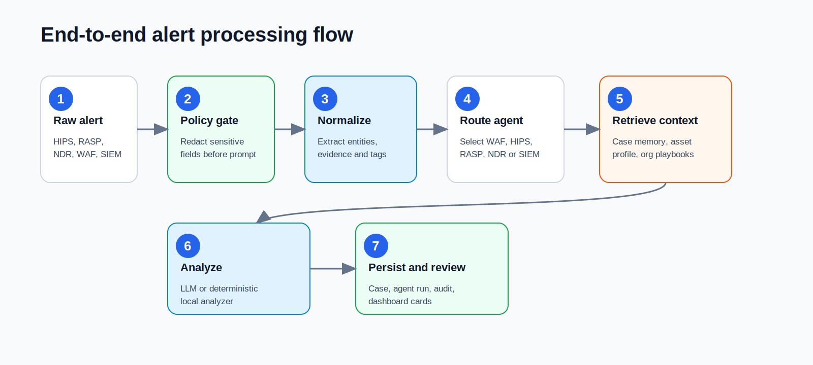
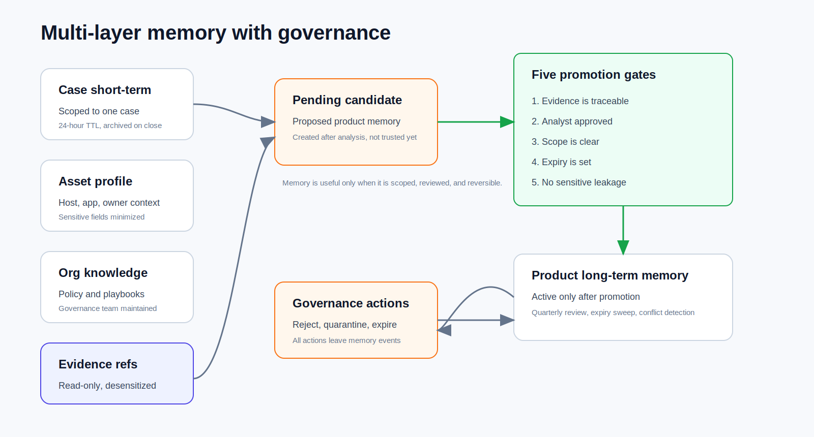

# Building a Defensive AI Gateway for Regulated SOC Environments

AI is becoming a practical part of security operations, but the harder question is not whether a model can summarize an alert. The harder question is whether an organization can use AI in a way that is governed, traceable, deployable in restricted environments, and safe for production operations.

That was the design goal behind this Defensive AI Gateway MVP: a lightweight, offline-friendly gateway that receives alerts from security products, normalizes them into a common evidence model, routes them to product-specific agents, applies policy controls, and produces analyst-ready case summaries and next-step recommendations.

The project is intentionally conservative. It does not try to replace the SOC analyst, and it does not execute blocking, isolation, policy changes, or other high-impact actions automatically. Instead, it focuses on a narrower and more realistic pattern for regulated environments:

**Use AI to accelerate investigation, preserve evidence discipline, and keep humans in control of response.**

## Why a Gateway Instead of a Generic Security Chatbot?

Most enterprise SOC teams already operate across multiple detection surfaces:

- HIPS and EDR-like host alerts
- RASP findings from application runtime protection
- NDR detections from network behavior
- WAF events from web traffic inspection
- SIEM correlation cases across multiple sources

A generic chatbot can help an analyst think, but it does not naturally solve the operational problems around ingestion, normalization, evidence boundaries, prompt safety, auditability, or deployment in an air-gapped environment.

The gateway pattern gives those concerns a home.

In this MVP, each incoming alert is converted into a normalized event with common fields such as product, event type, severity, entities, evidence, sensitivity tags, and a reference back to the raw alert. The raw alert is stored for traceability, while the prompt path uses redacted and normalized evidence.

The result is a system that behaves less like a free-form assistant and more like a governed analysis service.

## Architecture Overview

The MVP uses a simple stack on purpose:

- Python 3.11+ with standard library first
- Built-in HTTP server for the API and dashboard
- SQLite as the local fact store
- Static HTML, CSS, and JavaScript dashboard
- Product-specific agents for HIPS, RASP, NDR, WAF, and SIEM
- A pluggable LLM adapter that can use a deterministic local analyzer, Ollama, or an enterprise LLM gateway
- A policy engine for redaction, approval rules, and read-only operating mode
- A memory manager with governance controls

This design keeps the MVP easy to inspect, easy to package, and easier to migrate into an enterprise network where dependency review and supply-chain controls matter.

## Alert Processing Flow

The processing flow is deliberately explicit:

1. **Receive a raw alert** from a security product or SIEM case feed.
2. **Apply policy controls** such as sensitive field redaction and read-only response constraints.
3. **Normalize the event** into common entities, evidence items, and sensitivity tags.
4. **Link the event to a case** using stable product, host, source IP, or rule-based identifiers.
5. **Route to a product-specific agent** such as WAF, HIPS, RASP, NDR, or SIEM.
6. **Load governed context** from case memory, product memory, asset profile, organization knowledge, and evidence references.
7. **Analyze through the configured LLM adapter** and produce structured output.
8. **Persist the result** as a case, agent run, memory event, and audit record.
9. **Present the outcome** in the dashboard for analyst review.

The agent prompt requires structured JSON output and asks for classification, confidence, reasoning, missing evidence, business impact, and recommended next steps. Recommendations are policy checked before being surfaced. High-impact actions are marked as approval-required rather than automated.

This is an important distinction. In a bank or similarly regulated organization, the fastest possible response is not always the best response. A defensible response must be explainable, reversible, and aligned with approval policy.

## Product-Specific Agents

One design choice I found useful was keeping agent roles product-specific instead of creating a single general-purpose "security agent."

Each detection surface has different context:

- A WAF agent should reason about HTTP transactions, business endpoints, rules, parameters, and false-positive cost.
- A HIPS agent should pay attention to parent-child processes, command lines, hashes, logon sources, and patch windows.
- An NDR agent should focus on communication patterns, periodicity, TLS fingerprints, data volume, and unusual destinations.
- A RASP agent should look at runtime context, stack traces, taint sources, and deployment windows.
- A SIEM agent should combine multiple signals into a timeline and attack-chain hypothesis.

This separation makes prompts easier to reason about and makes it possible to version skills independently. It also reduces the temptation to give one model an overly broad mission.

## Memory Is Useful, but Only With Governance

One of the most interesting parts of the project is the memory model. Security memory can help with continuity, but unmanaged memory is also a risk. It can preserve false assumptions, leak sensitive material, or become a source of prompt poisoning.

The gateway therefore separates memory into layers:

The layers are:

- **Case short-term memory** for the current investigation, with a short TTL.
- **Product long-term memory** for reusable lessons tied to a product or rule family.
- **Asset profile memory** for host, app, owner, and baseline context.
- **Organizational knowledge** for policies, playbooks, escalation paths, and communication templates.
- **Immutable evidence references** that agents can read but not write.

The system does not automatically promote a case observation into long-term memory. Promotion must pass five gates:

1. Evidence is traceable.
2. An analyst approved the memory.
3. The scope is clear.
4. An expiry time is set.
5. No sensitive leakage is detected.

This turns memory from an opaque accumulation of model context into an auditable knowledge-management workflow.

## Safety Defaults

The project uses several safety defaults that are especially important in defensive security:

- **Read-only by default.** The system recommends observation, correlation, validation, and escalation steps before any high-impact response.
- **Approval-required actions.** Blocking, isolation, account disablement, scanning, exploitation, payload generation, and policy changes are marked for human approval.
- **Prompt redaction.** Sensitive fields such as tokens, cookies, authorization headers, passwords, phone numbers, ID cards, and customer identifiers are redacted before prompt construction.
- **Evidence discipline.** Agents are instructed to reason only from provided evidence and to report missing evidence rather than invent details.
- **Local fallback.** A deterministic local analyzer supports offline testing and repeatable harness runs.

These choices may sound modest, but they are what make the architecture operationally credible.

## Deployment Path

The MVP is designed to move through three stages.

**Stage A: Offline-friendly MVP**

Use Python standard library components, SQLite, a static dashboard, local replay samples, and a deterministic analyzer or local Ollama model. This is suitable for rapid iteration and architecture validation.

**Stage B: Enterprise PoC**

Replace SQLite with PostgreSQL or an enterprise relational database. Put the service behind an API gateway, mTLS, reverse proxy, centralized logging, and secret management. Replace the local analyzer with an enterprise LLM gateway.

**Stage C: Production hardening**

Introduce OPA or ABAC policy enforcement, richer identity controls, vector or graph retrieval for memory, SOAR or ticketing integration, and a replay harness as a release gate for prompt, model, skill, and policy changes.

## What This Prototype Demonstrates

This project is not a full production SOC platform, and it is not trying to be one. Its value is in showing a practical architecture for introducing AI into security operations without skipping the boring but necessary controls.

The main lesson is that defensive AI should be treated as a governed workflow component, not a magic layer beside the SOC.

The useful unit is not just "a prompt." It is the full loop:

- input normalization
- sensitive data handling
- agent routing
- memory governance
- policy enforcement
- structured output
- audit trail
- analyst review
- repeatable harness testing

That loop is what gives an AI-assisted system a chance to survive contact with regulated environments.

## Closing Thought

Security teams do not need AI systems that act with unlimited autonomy. They need systems that reduce investigation friction, improve evidence quality, make reasoning easier to review, and respect operational boundaries.

For me, the most promising direction is not "AI replaces the SOC analyst." It is:

**AI helps the SOC analyst move faster while the architecture keeps the organization safer.**

#CyberSecurity #AI #SOC #SecurityOperations #LLM #DefensiveAI #ThreatDetection #Governance #BankingSecurity #IncidentResponse

