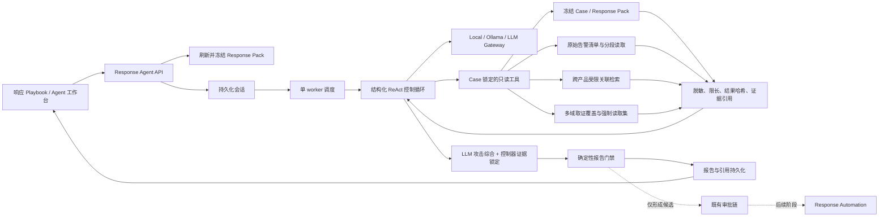
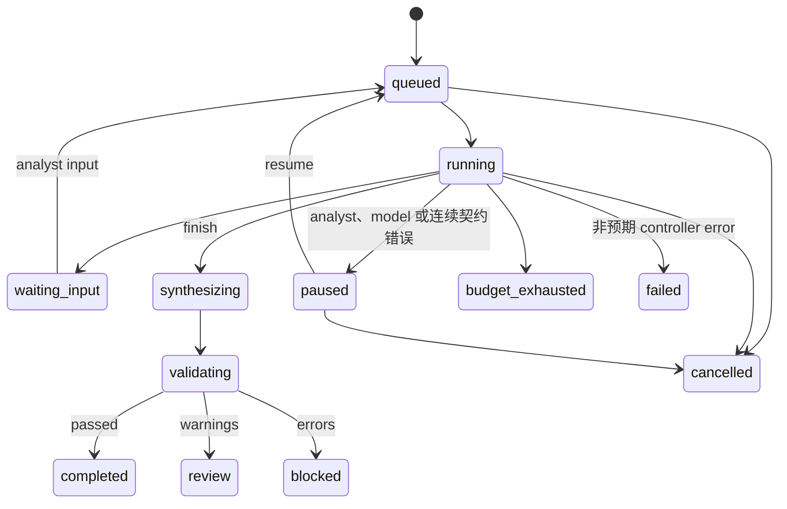

# Defensive AI Response Agent 方案与迭代记录

更新日期：2026-07-30
当前状态：第一阶段 v8 已实现（含控制器优先证据基线、攻击导向 ReAct 调查、原始 Syslog 深读、LLM 最终综合、控制器证据锁定、多域取证与完整调查计时）

## 1. 目标与原则

Response Agent 位于“AI 响应工作台 -> 响应 Playbook”，把一次性静态建议扩展为可暂停、可恢复、可审计的深入调查会话，并最终生成具有完整结论和证据引用的报告。

核心原则：

1. **模型负责规划，控制器负责权限。** LLM 只能从固定工具白名单中选择下一步，不能决定 Case 范围、凭据、网络目标或执行权限。
2. **证据、状态和报告可恢复。** 会话、步骤、工具调用、结果哈希、报告与引用均持久化到 SQLite。
3. **不保存隐式思维链。** 系统只保存简短决策摘要、工具参数、结构化观察和证据引用。
4. **调查与执行分离。** 第一阶段不开放 Shell、任意 HTTP、浏览器、设备连接器或生产处置；响应建议只能是 `observe` 或 `approve_required`。
5. **结论可以是证据不足。** 报告完整性不等于必须判定攻击成立；证据不足本身可以成为最终结论。

### 1.1 本次问题与结论

线上会话 `response_agent_7da2d20a833a418a` 在首轮模型决策后失败，错误为 `ValueError: tool arguments attempted to override controller scope`。根因不是数据库或工具执行失败，而是模型在工具参数中重复返回了当前 `case_id`，旧控制器把“重复且一致的范围”与“尝试切换到其他范围”都视为致命错误。

v2 的处理规则为：

- 与控制器一致的 `case_id`、`session_id` 或源快照哈希会被校验后移除，不再导致失败。
- 与控制器不一致的范围、租户或组织参数仍会拒绝。
- SQL、表名、数据库路径、URL、endpoint、Shell 和 command 在任意嵌套层级均会拒绝。
- 决策或工具契约错误会记录安全错误码并让模型最多修正三次；连续失败后进入可恢复的 `paused`，不再直接落入 `failed`。
- 旧失败会话保留为审计记录；部署新版本后应创建新会话重新调查。

### 1.2 原始 Syslog 缺口问题与 v3 结论

历史报告曾出现 “initial HTTP request payloads ... are not fully captured” 一类表述。复核工具调用与原始数据库后确认：

- 采集器保存的 `_syslog_envelope.raw_message` 已完整持久化，可按 RFC 6901 指针和 UTF-8 位元组游标读取；历史关键记录的分块均到达 `complete=true`。
- 部分 RASP 事件的 `request_message.body` 在源事件中就是 `null`，参数也可能为空；该信息无法通过扩大 prompt 或重复数据库查询重建。
- 旧完成门禁只强制完整读取一条原始候选，因此即使关联搜索找到多条 RASP/EDR/HIPS 证据，也可能在未逐条读取时进入报告综合。
- v3 在 manifest 中明确返回原始 Syslog 指针、字节数、计算哈希、采集信封记录哈希和完整性状态，并对请求体、参数、请求头、响应状态与响应体输出 `captured_nonempty/captured_empty/captured_null/not_observed` 诊断。
- v3 从 Case 关联和跨产品相关告警中选择最多 8 条高优先级原始证据作为强制读取集。控制器逐条续读到 `complete=true`，报告门禁再次独立校验。
- 源字段为 null、空值或未观察到时，报告必须表述为“源端采集缺失”，并保留补采步骤；不得描述为 Agent 分块读取或 prompt 截断。已采集的响应状态必须直接用于结论。

### 1.3 生产案例复核与 v4 语义修正

针对 Case `case_rasp_VM-0-7-centos_cloudrasp_list_file_102`、会话 `response_agent_385664f739d94f08` 的复核结论：

- Agent 对 4 条入选 RASP 原始 Syslog 共执行 9 次分块读取，各流均从 offset 0 连续读到末尾，分块内容没有被 prompt 截断。
- 告警 `82ae6aa8af954b89a2e8582ed71b2f9e` 是无查询串的 GET，请求体为 `null`、参数为 JSON 字符串 `"{}"`；告警 `f3574556fc954b1f976a2f9ae013398d` 是 `Content-Length: 0` 的 POST，字段状态相同。两者均为协议语义明确的空载荷，旧报告 9.2/9.5 属于诊断假阳性。
- 4 条告警的 `response_message.status_code` 均为整数 `0`，采集器保存的原始 Syslog 与数据库 `original_log` 对应内容一致。HTTP 合法状态范围是 100-599，因此旧报告 9.1/9.3/9.4/9.6 所述“未采集可验证响应状态”是真实源端缺口。
- 4 条采集信封均未提供可比对的 `raw_message_sha256`，所以 `syslog_message_integrity=unverified`。这不表示已发现篡改，但不能据此宣称源端到采集器的传输完整性已验证。
- `complete=true` 只证明本次选择的、脱敏后的数据库序列化内容已读到末尾；它不能单独证明发送端、Syslog 传输或供应商采集完整。传输结论必须单独引用 `syslog_message_integrity`。

v4 增加以下确定性规则：

- JSON 字符串形式的空对象、空数组、空字符串与 `null` 分别归一为 `captured_empty` 或 `captured_null`，不再一律视为非空文本。
- 新增组合字段 `http_request_payload`，综合请求体、参数、URL 查询串、HTTP 方法、`Content-Length` 和 `Transfer-Encoding` 判断 `captured_nonempty`、`captured_empty`、`captured_incomplete` 或 `not_observed`。
- URL 查询串本身属于已采集请求内容；GET/HEAD 在请求 URL 已观测且无查询串时可判定明确空载荷；`Content-Length: 0` 可判定明确空载荷；声明正长度或分块传输但正文缺失时必须判定不完整。
- 原始读取门禁要求每个证据流从 offset 0 连续覆盖到总长度，逐块复算 SHA-256，保持总长度、完整内容哈希和来源哈希一致，将读取时的来源哈希绑定到取证盘点，并在末块对拼接内容重新计算完整 SHA-256。跳读、断档、身份错配、源记录变化、元数据漂移或哈希不一致均不能通过报告门禁。
- 历史完成报告保持不可变；部署 v4 后通过“重新执行”创建的新会话才会使用新诊断与门禁。

### 1.4 v5 报告缺口与计时审计修正

- `captured_empty` 表示 HTTP 语义可以确认的空载荷，不再作为请求证据缺口写入报告；`captured_null`、`captured_invalid`、`captured_incomplete` 和 `not_observed` 仍保留为来源采集缺口。
- 页面“活动时长”使用会话创建到终态完成的 `elapsed_seconds`，覆盖排队、ReAct 调查、报告综合和验证阶段。

### 1.5 v6 原始证据交叉诊断与报告事实权威

- HTTP 诊断明确拆分 `mapped_projection`、`stored_original_log` 和 `syslog_raw_message` 三层，支持 RASP、原生 WAF 与 ECS 常见字段；当可信原文与映射层不一致时，报告采用原始层结论并单独记录适配规则缺口。
- HTTP 字段规范化支持 snake_case 与 CamelCase；正文中的 bytes/contentLength 等元数据只证明声明长度，不能冒充正文内容。响应状态可解析合法三位码及 `403 Forbidden` 一类标准文本，普通业务 `method/status` 不会单独建立 HTTP 上下文。
- 只有服务器保留的 Syslog 信封精确路径可以生成关联支点；普通业务字段中的同名 `raw_message` 不会被解码。信封哈希不一致时，原文只作为完整性异常展示，不能覆盖映射事实、生成 HTTP 观察值或扩大调查范围。
- Syslog 信封分别保留原始 wire bytes 哈希与实际入库 UTF-8 文本哈希；含非法 UTF-8 字节的新消息仍按 wire 哈希留存传输身份，并用文本哈希校验可查询的持久化内容。缺少文本摘要的历史有损记录标记为 `unverified/legacy_lossy_utf8`，不会因替换字符误报为篡改。
- 原始 Syslog 的解析受大小、嵌套深度和节点数限制，报告只暴露字段状态、指针、哈希与来源层，不将未脱敏原文直接写入诊断结果。
- 报告中的证据缺口、来源限制和全部事实字段只由本轮控制器诊断生成；早期 LLM 研判只记录为非权威背景，不能进入权威缺口。ReAct 模型负责规划调查与选择受控工具，工具证据齐备后由控制器直接编译执行摘要、结论、发现、假设、影响、取证轨迹、响应计划和最终评估，不再发送第二份完整取证上下文请求模型改稿；因此同义改写不能把明确空请求重新描述成“未采集/截断”。
- 取证盘点在 200 条有界预算内自动分页，强制完整读取集与每个 workstream 都按 Case 关系、产品和取证域覆盖选择，避免第 21 条之后的 WAF、EDR 或 HIPS 被大量同类 RASP 告警挤出。
- 控制器在正常完成、请求人工输入、模型/工具拒绝暂停、模型异常暂停、工具预算退出、重复调用自动综合及未预期异常失败等所有离开运行态的路径，都会累计并持久化 `usage.active_seconds`。
- 完整 SHA-256 只在控制器证明的精确路径和值（冻结快照和调查日志结果哈希）保持原值；任意 `hash/*_hash/*_sha256` 字段不享有全局豁免，敏感字段仍优先脱敏。
- 进入模型与报告门禁前同时扫描 JSON 键名和标量值；键名中的邮箱、凭据或 token 会先替换，`password_value/token_value/credential_value` 等复合敏感字段按同一结构规则脱敏，`session_count` 等非标识指标不会因宽泛前缀规则被误拦截。
- 已完成的旧报告与旧用量记录不回写；重新执行产生的新会话使用 v6 诊断、报告缺口和计时规则。

### 1.6 v7 攻击导向调查与 LLM 最终综合

v6 解决了原始证据完整性和错误缺口叙述，但由控制器直接编译整份报告会使调查结果偏向采集状态清单，弱化攻击行为、关联活动、攻击链和风险判断。v7 调整职责边界：控制器继续决定权限、范围、证据身份和安全约束，LLM 在 ReAct 调查完成后基于受控调查档案生成最终分析叙述。

- `query_case_raw_alerts` 在不暴露请求头和正文的前提下投影事件时间、源 IP、主机、应用、方法、URL、规则、动作、危险调用点、Hook 参数和检测证据；分页压缩会为每条结果保留这些关键攻击事实以及 `total/offset/next_offset`，不会因通用大小裁剪静默丢失后续事件。
- `query_forensic_coverage` 的活动清单和八类工作流采用独立预算；每条活动保留来源、目标、URL、规则和动作，每个工作流固定保留 ID、标题、领域、状态、覆盖摘要和补采步骤。
- 最终综合上下文按攻击事实优先级组装，显式包含 Case 锚点、关联活动、攻击链种子、风险种子、调查范围、精确证据限制、原始读取摘要、工具账本和 Playbook，不再依赖按键名字典序裁剪。
- 非本地规则模型会执行一次最终 LLM 综合，重点回答发生了什么、同源/同目标活动如何关联、攻击阶段、利用或失陷程度、潜在影响和处置优先级。模型不可用或输出不合约时会话暂停，不会把缺失的模型分析伪装成已完成报告。
- LLM 偶发返回非对象或无效 JSON 时，规划与最终报告综合会分别在不执行工具、不保存无效报告的前提下自动重试最多 3 次，并把边界内的每次拒绝写入调查轨迹；重试始终服从会话墙钟预算，暂停或取消后返回的晚到响应会被丢弃且不会继续累计活动时长。连续 3 次仍不合约才暂停，网络、鉴权或端点配置错误仍立即暂停。
- 控制器锁定告警 ID、时间、来源、目标、关系、引用、攻击链事件和精确证据缺口；模型只能补充有引用的分析，不得新增未知事件、改写证据身份或把关联命中升级成已确认事实。
- 风险状态由控制器限制在证据允许的上界。仅 RASP 运行时命中可证明危险操作到达插桩点，但 `action=log` 不证明阻断，HTTP 状态 `0` 不证明请求成功；缺少独立 EDR/HIPS/Sysmon/auditd 强证据时，模型不能宣称主机已确认失陷。
- 模型建议的破坏性动作会统一升级为 `approve_required`，报告门禁拒绝任何以 `observe` 绕过审批的隔离、终止、删除、封禁或凭据变更动作。
- 取证领域由实际产品和证据指针驱动。RASP 不再仅凭源 IP 自动标记端点、网络或持久化已覆盖；没有进入 Gateway 数据库的 WAF、EDR、HIPS、NDR、主机日志或供应商遥测必须标为 `collection_required`，其缺失不能当作没有攻击活动的反证。
- 控制器只信任冻结快照和调查日志中精确路径上的 SHA-256。原始日志正文里恰好出现的 64 位十六进制字符串仍按普通不可信数据脱敏，避免摘要误配或敏感信息豁免。
- 前端把风险判断、攻击时间线和同源/同目标关联活动前置展示，八类取证覆盖和工具账本收进默认折叠的技术附录，使报告首先服务于安全分析与响应决策。
- v8 重新执行成功并写入新报告时，会在同一事务中删除该 Case 的旧报告及旧报告引用，仅保留最新报告；历史会话、步骤和工具调用继续作为审计轨迹保留。失败、取消或尚未生成报告的重跑不会删除上一份有效报告。
- 部署 v8 后使用“重新执行”生成新会话和 `response-investigation-report-v6` 报告。

## 2. 第一阶段实现范围

### 2.1 已实现

- Playbook 标题右侧“唤起调查 Agent”入口。
- 桌面端 480px 右侧工作台，移动端全屏工作台。
- 单 Case 同时仅允许一个活跃调查会话。
- 启动时自动检查 Response Pack；缺失或过期时先生成当前版本。
- 冻结标准化 Case 源快照和 Response Pack 制品，并把后续只读 DB 观察按检索时间、结果哈希和证据引用单独记录。
- 查询 Case 关联原始告警清单、字段目录和原始载荷大小。
- 验证采集器保存的原始 Syslog 指针、字节数、SHA-256 与信封完整性。
- 使用 Case 自身实体检索 WAF、EDR、HIPS、RASP、NDR、SIEM 等相关的 normalized 或 raw-only 告警。
- 对已关联或达到相关性门槛的告警，按 RFC 6901 字段和 UTF-8 位元组偏移读取脱敏后的完整原始内容。
- 固定执行 Web 请求、服务器运行时、端点进程、文件完整性、网络边界、身份认证、持久化和云/容器八类取证覆盖盘点。
- 后台持久化 worker；进程重启后将中断中的任务重新排队。
- `queued -> running -> synthesizing -> validating -> completed/review/blocked` 状态链。
- `waiting_input`、`paused`、`failed`、`cancelled`、`budget_exhausted` 分支。
- 暂停、继续、取消、人工补充信息。
- Gateway/Ollama 的通用结构化 JSON 生成接口。
- 本地规则模型的可复现调查路径，支持离线 Demo 和回归测试。
- 完整报告、确定性报告校验门、引用清单和新证据过期提示。
- Analyst 写权限；read/analyst/approver/responder 读权限。

### 2.2 明确不包含

- 不直接创建或执行生产处置。
- 不调用任意外部 URL、搜索引擎、Shell 或浏览器。
- 不读取设备凭据、密钥或未脱敏载荷；原始日志中的已知敏感字段在进入 LLM 和持久化工具结果前统一脱敏。
- 不接受模型生成的任意 SQL、WHERE 条件、数据库路径或表名。
- 不由模型绕过现有 Validator、审批和 Response Automation。
- 不做多 Agent 自由协作或无限递归规划。

## 3. 运行架构



模型调用和工具查询均在数据库事务之外完成。事务只包围短时间的状态、步骤、工具结果和报告写入，避免远程模型延迟长期占用 SQLite 锁。

## 4. 结构化 ReAct 机制

每一轮模型必须返回一个 JSON 对象：

```json
{
  "action": "tool_call | request_human_input | revise_plan | finish",
  "tool_name": "query_case_snapshot",
  "arguments": {},
  "rationale": "简短的可审计决策摘要",
  "question": "",
  "plan_updates": []
}
```

控制器执行以下校验：

- `action` 必须属于固定枚举。
- `tool_name` 必须属于工具白名单。
- 与服务端固定范围一致的冗余 `case_id/session_id/source_snapshot_hash` 会被校验并移除；任何不一致值均会拒绝。
- 参数不得包含 SQL、表名、数据库路径、URL、endpoint、Shell 或 command。
- 每个工具使用独立参数契约；未知参数被丢弃，数值、列表和游标由控制器归一化和限界。
- 当模型把 `_syslog_envelope/syslog_envelope/syslog_route` 的 `raw_message` 路径写成别名，或把十六进制告警 ID 截断/改写时，控制器只按已完成 manifest 中唯一命中的至少 8 位共同前缀和唯一权威指针纠偏，并在步骤、幂等键和工具调用持久化前完成规范化；非 Syslog 读取、非十六进制 ID、短前缀、歧义或无清单命中时均不猜测。
- 同一工具和参数通过幂等键复用既有结果。
- 八项基线只读工具由控制器按固定顺序直接调度，不再为确定性必查动作重复调用模型；所有控制器生成参数也进入与模型参数相同的规范化、范围和幂等校验。
- 模型返回 `finish` 只是综合请求：控制器会按照 `query_forensic_coverage` 的强制读取集，把最多 8 条高优先级原始 Syslog、`/original_log` 或完整原始告警逐条从 offset 0 连续读取到末尾。
- 确定性报告门禁会独立检查上述证据下限；缺少基线工具或原始分段未完成的报告只能进入 `blocked`，不能得到 `passed`。
- 模型重复相同工具与规范化参数时直接复用不可变结果；若证据下限仍有缺项，控制器立即推进下一项必需只读工具，只有下限完整时才进入报告综合。
- 达到轮次、工具调用或活动时间预算时进入 `budget_exhausted`。
- 配置下限为 18 轮、16 次工具调用；默认仍为 48 轮、40 次工具调用。工具预算只阻止新的工具调用，不阻止已有观察进入报告综合。
- 模型不可用时进入 `paused`，不会静默切换为本地规则结论。
- 连续三次决策或工具契约拒绝后进入 `paused`；错误码、重试状态和审计事件均持久化。

本地 `local-rule-analyst` 与 Gateway/Ollama 都由控制器完成八项基线工具；Gateway/Ollama 的模型调用保留给原始分块研读、自适应补查、结束判断和一次最终综合。两条路径使用相同持久化、工具、安全和报告门禁。

## 5. 第一阶段工具白名单

| 工具 | 输入范围 | 输出 | 主要引用 |
|---|---|---|---|
| `query_case_snapshot` | 冻结 Case | Case 基线、最新研判、Validator、Response Pack | event、evidence、response_pack |
| `query_case_evidence` | 冻结 Case | 标准化事件、实体和证据 | event、evidence |
| `query_case_raw_alerts` | 当前 Case 链接 | 原始告警 manifest、大小、源哈希、无值字段目录 | raw_alert |
| `search_related_alerts` | Case 派生实体、产品列表、时间窗 | normalized 与 raw-only 跨产品关联告警 | correlated_raw_alert |
| `query_forensic_coverage` | 当前 Case 与控制器固定关联范围 | 八类取证覆盖、源字段采集诊断、最多 8 条强制原始读取流与补采步骤 | raw_alert、correlated_raw_alert |
| `read_raw_alert_chunk` | manifest/search 返回的 alert_id、RFC 6901 pointer、位元组游标 | 脱敏 UTF-8 JSON 分段、完整内容哈希、分段哈希 | raw_alert |
| `query_case_timeline` | 冻结 Case | 安全事件、研判、审批与响应时间线 | event、evidence |
| `query_governed_memory` | 当前 Case/产品 | Case active memory、已批准 active product memory | memory |
| `query_response_status` | 冻结 Case | 审批、投票、响应任务、尝试和执行边界 | approval、response_task |

数据库工具不是“给 LLM 一个 SQL 客户端”。控制器只暴露固定 DSL：

- 关联锚点只从当前 Case 已链接的 normalized entities 与 raw payload 中提取，模型不能自行提供 IP、用户、host 或其他查询值。
- 仅提取 allowlist 字段：trace/request ID、IP、host、user、app、process、rule 和 URL。
- 相关性分数至少为 5，避免仅因常见 rule 或 URL 相同就开放原始载荷。
- 搜索同时受时间窗、候选笔数和原始 JSON 总位元组限制；产品参数经过字符 allowlist，并使用参数化 SQL。候选行上限和位元组上限均独立返回明确的截断原因，报告不得把达到任一上限的结果描述为完整扫描。
- `read_raw_alert_chunk` 会再次计算“已链接或已达到相关性门槛”，不能通过猜测 alert_id 越界读取。

完整原始日志读取采用 manifest + chunk：

1. manifest 返回元数据、大小、源哈希、不含字段值的 JSON Pointer 目录，以及原始 Syslog 指针、字节数、SHA-256、完整性和 HTTP 采集状态；
2. 控制器优先选择采集器保存的 `/_syslog_envelope/raw_message` 或 `/syslog_route/raw_message`，其次选择 `/original_log`，最后选择完整受控原始告警；
3. 控制器在完整对象上先执行深度脱敏，再按 UTF-8 位元组游标分段；默认单段 6144 bytes，保证最新分段能完整进入当前模型 prompt，并在不跳过逐段研读的前提下降低分段和规划次数；
4. `next_offset` 可连续读取到 `complete=true`，避免 prompt 截断导致尾部证据丢失；
5. 每段提供 chunk SHA-256，所有分段共享脱敏后完整内容 SHA-256 与原始来源哈希；
6. 完成门禁从 offset 0 验证连续偏移、逐块 SHA-256、稳定的总长度与来源元数据，并对拼接内容重算完整 SHA-256。`complete=true` 不代替 `syslog_message_integrity`，也不代表供应商已经采集所有 HTTP 字段。

最新原始分段在 planner/report context 中具有最高优先级。模型继续下一段或进入报告前，必须在公开的短 `rationale` 中保留本段事实摘要；控制器把最近 40 条摘要作为滚动调查笔记传入后续轮次和报告综合。这里只保存可审计事实，不保存隐式思维链。若模型在分段尚未完成时请求 `finish`，控制器自动续读 `next_offset`；若任一强制读取流在轮次或工具预算内仍未读到 `complete=true`，会话进入明确的预算终态或报告门禁 `blocked`，不能把抽查单条或未完成读取表述为完整取证。

工具结果进入模型前不是简单截取前 N 个字节。清单、分页活动、取证工作流和最终综合上下文分别使用结构化压缩器：先保留分页契约、证据身份和攻击事实，再在剩余预算中加入诊断细节。任何达到扫描笔数、原始位元组、分页或上下文预算的情况都以结构化限制返回，报告不得把有界查询描述为全库完整扫描。

### 5.1 深度取证工作流

`query_forensic_coverage` 固定生成以下八个工作流，模型不能删除、改写状态或绕过补采步骤：

1. Web 请求与响应重建：WAF、反向代理、Web 访问日志和 RASP 请求/响应字段。
2. 服务器与应用运行时：主机标识、应用进程树、命令行、工作目录、网络连接、登录会话和容器运行时日志。
3. 端点进程与执行链：EDR/HIPS/Sysmon/auditd 的进程、脚本、模块、文件与网络遥测。
4. 文件完整性与 Webroot：Webroot、上传/临时目录、应用配置、疑似 WebShell 和被读取文件的元数据与哈希。
5. 网络与边界设备：WAF、NDR、IDS/IPS、防火墙、负载均衡和 DNS 会话。
6. 身份与认证：系统、应用、堡垒机、IAM/IdP 登录、提权、账号与权限变更。
7. 持久化：计划任务、服务、启动项、Shell 配置、动态加载项和自动部署目录。
8. 云与容器控制面：云审计、工作负载事件、镜像摘要、Pod/容器生命周期、服务账号和网络策略。

每个工作流状态为 `evidence_available`、`partial` 或 `collection_required`。第一阶段仍不开放实时 Shell、任意网络访问或供应商凭据；当本地数据库证据不足时，报告给出只读保全与补采步骤，后续通过受控 EDR、SIEM、CMDB、对象存储等只读连接器落地。

所有工具结果依次经过：

1. `PolicyEngine.redact()` 深度脱敏；序列化原文中带引号的敏感字段值会整体替换，值内空格、逗号和转义引号不会造成尾部泄露；
2. 结构化字节上限裁剪；
3. SHA-256 结果哈希；
4. 引用清单绑定；
5. SQLite 持久化。

证据内容中的提示、命令和 URL 一律按不可信数据处理，不能改变控制器规则。

## 6. 状态模型



Case 进入 `closed` 或 `false_positive` 时，所有活跃调查会话与现有待审批/响应任务一起终止。

## 7. 数据模型

SQLite schema v17 新增：

- `response_agent_sessions`：Case、Response Pack、冻结源快照、目标、计划、预算、用量、模型元数据和状态。
- `response_agent_steps`：顺序化计划、工具决策、观察、人工输入和系统步骤。
- `response_agent_tool_calls`：工具版本、参数、幂等键、结果、结果哈希、引用和错误。
- `response_agent_reports`：版本化内容、源快照哈希、内容哈希、报告门禁和模型元数据。
- `response_agent_report_refs`：报告 claim 到证据、记忆、审批和响应任务的引用映射。

部分唯一索引保证每个 Case 同时只有一个活跃会话。终态会话不会阻止后续基于新证据创建新版本。

SQLite schema v18 新增 `raw_alerts(created_at_ms, alert_id)` 与 `raw_alerts(product, created_at_ms, alert_id)` 索引，为有时间窗和产品过滤的关联扫描提供稳定访问路径。没有新增可由浏览器或模型直接调用的数据库 API。

## 8. API 与权限

读取接口：

```text
GET /api/cases/{case_id}/response-agent/latest
GET /api/response-agent/sessions/{session_id}?after_sequence={n}
```

写接口：

```text
POST /api/cases/{case_id}/response-agent/start
POST /api/response-agent/sessions/{session_id}/pause
POST /api/response-agent/sessions/{session_id}/resume
POST /api/response-agent/sessions/{session_id}/cancel
POST /api/response-agent/sessions/{session_id}/input
```

- GET：`read`、`analyst`、`approver`、`responder`。
- POST：仅 `analyst`。
- Actor 始终取自服务端认证主体；请求体中的伪造 actor 不生效。
- 前端使用 `after_sequence` 增量取得新步骤，同时刷新会话状态、工具元数据、结果哈希和报告；完整工具结果不下发浏览器。
- 工具参数和结果只保存在服务端审计图中；浏览器仅看到安全摘要、哈希与引用，避免原始日志经 UI 扩散。

## 9. 报告与确定性门禁

报告固定包含：

- 执行摘要；
- 风险等级、攻击状态、可能性、影响等级、加重因素和缓解因素；
- 分类、置信度、结论、依据和限制；
- 按证据时间锁定的攻击时间线；
- 同源、同目标和其他 Case 实体关联活动；
- `confirmed`、`inferred`、`unverified` 分级发现；
- 攻击链；
- 影响分析；
- 八类深度取证工作流、覆盖状态、证据源与补采步骤；
- 证据缺口；
- 只读或需审批的响应计划；
- 调查工具日志；
- 最终判断；
- 固定执行边界。

报告门禁检查：

- 源快照与 Response Pack 绑定；
- 工具全部来自白名单；
- 引用存在于本次工具观察或 Response Pack；
- 无引用的 confirmed/inferred claim 自动降为 unverified；
- 仅表达“证据不足”的句子不能作为 confirmed/inferred finding，会从发现列表中移除并由控制器证据缺口承载；
- 无直接执行或直接发送能力；
- 响应模式仅为 `observe` 或 `approve_required`；
- 关联活动和攻击链中的证据身份、时间、关系与引用均来自控制器；模型新增的未知事件会被丢弃；
- 风险状态不能超过当前跨产品和主机证据允许的上界；破坏性建议必须为 `approve_required`；
- 响应计划每一步必须包含理由、成功标准、回滚和有效证据引用；
- 当跨来源、响应结果或主机证据不支持失陷时，报告不得用“已初始突破、成功利用或主机失陷”等叙述绕过风险状态上界；
- 强制原始读取集全部从 offset 0 连续完成且分块/整流哈希一致，八类取证工作流及其控制器状态未被模型删除或改写；
- 无敏感信息泄漏；
- 继承原 Case Validator 的 `passed/review/blocked` 约束。

门禁结果含错误时为 `blocked`，仅有警告时为 `review`，全部通过时为 `completed`。Case 后续出现新证据不会改写当前报告，而会把会话和报告标记为 stale；成功重新执行并写入新报告后，旧报告及其引用会被原子替换。

## 10. 配置与运维

```yaml
response_agent:
  enabled: true
  max_turns: 48
  max_tool_calls: 40
  max_wall_seconds: 900
  tool_result_max_bytes: 48000
  correlation_window_minutes: 1440
  correlation_scan_limit: 2000
  correlation_scan_max_bytes: 64000000
  raw_chunk_max_bytes: 6144
```

环境变量：

```text
DEFENSIVE_AI_RESPONSE_AGENT_ENABLED
DEFENSIVE_AI_RESPONSE_AGENT_MAX_TURNS
DEFENSIVE_AI_RESPONSE_AGENT_MAX_TOOL_CALLS
DEFENSIVE_AI_RESPONSE_AGENT_MAX_WALL_SECONDS
DEFENSIVE_AI_RESPONSE_AGENT_TOOL_RESULT_MAX_BYTES
DEFENSIVE_AI_RESPONSE_AGENT_CORRELATION_WINDOW_MINUTES
DEFENSIVE_AI_RESPONSE_AGENT_CORRELATION_SCAN_LIMIT
DEFENSIVE_AI_RESPONSE_AGENT_CORRELATION_SCAN_MAX_BYTES
DEFENSIVE_AI_RESPONSE_AGENT_RAW_CHUNK_MAX_BYTES
```

部署升级必须先做 SQLite 在线备份并执行 `PRAGMA quick_check`。进程启动时会将遗留的 `running/synthesizing/validating` 会话恢复为 `queued`；人工暂停和等待输入状态保持不变。

Agent worker 纳入 `/api/ready` 依赖检查；功能开启但 worker 异常退出时，服务进入 `not_ready`，避免入口健康但调查任务无人消费。

## 11. 后续迭代路线

### 第二阶段：可配置外部只读 Skill

- 引入版本化 Tool/Skill Registry，而不是直接增加自由工具。
- 把第一阶段 v2 的本地 SQLite DSL 作为权限与审计基线。
- 增加受控 CMDB、EDR 查询、SIEM 检索、对象存储归档和威胁情报只读适配器。
- 每个工具声明数据等级、Case scope、网络 allowlist、超时、结果上限和审计字段。
- 增加查询缓存、来源健康度、租户隔离、引用新鲜度和供应商分页游标。
- 验收门：任意工具故障可局部降级；无工具可突破 Case/租户边界。

### 第三阶段：响应候选进入既有审批链

- Agent 只能生成结构化 action candidate。
- 编译器把候选绑定 immutable event、evidence hash、scope、TTL、connector capability 和 rollback。
- Validator `passed` 且能力声明满足时才可创建幂等审批单。
- 不新增旁路执行器，继续复用 `ResponseAutomationService`。
- 验收门：重复提交不重复创建任务；Case 终态、TTL 和误报确认均触发取消或回滚。

### 第四阶段：多角色协作与评测

- Planner、Evidence Reviewer、Response Reviewer 可作为受控角色，而不是自由自治多 Agent。
- 角色共享同一 Case scope 和引用图，不共享隐式思维链。
- 引入离线 Agent Harness：工具选择准确率、引用覆盖率、结论一致性、越权率、成本和延迟。
- 对高风险 Case 支持 analyst checkpoint 和双人复核。
- 验收门：与单 Agent 基线相比，引用完整性和结论质量有可量化提升，越权率保持为零。

## 12. 已知边界

- 第一阶段仅使用本地数据库中的受治理事实；未进入 Gateway/SQLite 的历史遥测仍不可见。
- 当前“服务器深度取证”会盘点数据库内的 RASP、EDR、HIPS、Sysmon、auditd、进程、文件、网络、认证、持久化与容器证据，并输出只读保全步骤；第一阶段尚不登录生产主机，也不实时调用供应商控制台。实时补采需在第二阶段通过受控、只读、Case 锁定的连接器实现。
- “完整原始日志”指已存储载荷在策略脱敏后的完整内容，密钥、token、密码等不会提供给模型。
- 关联检索是确定性候选发现，不等同于攻击链确认；报告必须把关联命中与已确认事实分开。
- 默认关联窗为 Case 前后 24 小时，最大 7 天；达到候选或位元组上限时报告必须披露扫描截断。
- SQLite 单 worker 适用于当前单节点 MVP；多副本部署前需迁移到具备租约和并发 claim 的数据库。
- 通用结构化输出不等于模型天然可靠，最终可信边界仍是控制器、证据引用和确定性门禁。
- 报告是内部调查制品，不是生产执行证明，也不是对外沟通已发送证明。
