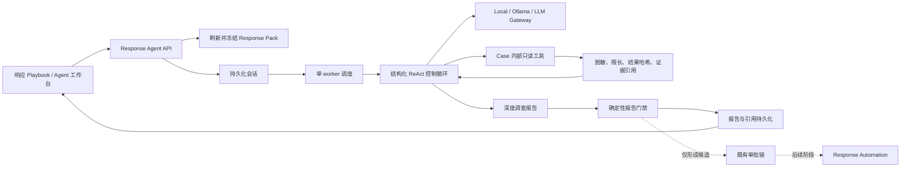
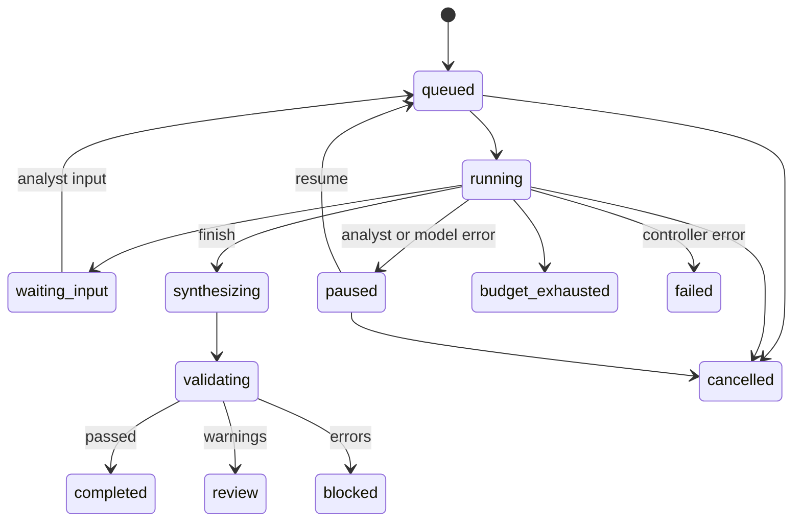

# Defensive AI Response Agent 方案与迭代记录

更新日期：2026-07-28
当前状态：第一阶段已实现

## 1. 目标与原则

Response Agent 位于“AI 响应工作台 -> 响应 Playbook”，把一次性静态建议扩展为可暂停、可恢复、可审计的深入调查会话，并最终生成具有完整结论和证据引用的报告。

核心原则：

1. **模型负责规划，控制器负责权限。** LLM 只能从固定工具白名单中选择下一步，不能决定 Case 范围、凭据、网络目标或执行权限。
2. **证据、状态和报告可恢复。** 会话、步骤、工具调用、结果哈希、报告与引用均持久化到 SQLite。
3. **不保存隐式思维链。** 系统只保存简短决策摘要、工具参数、结构化观察和证据引用。
4. **调查与执行分离。** 第一阶段不开放 Shell、任意 HTTP、浏览器、设备连接器或生产处置；响应建议只能是 `observe` 或 `approve_required`。
5. **结论可以是证据不足。** 报告完整性不等于必须判定攻击成立；证据不足本身可以成为最终结论。

## 2. 第一阶段实现范围

### 2.1 已实现

- Playbook 标题右侧“唤起调查 Agent”入口。
- 桌面端 480px 右侧工作台，移动端全屏工作台。
- 单 Case 同时仅允许一个活跃调查会话。
- 启动时自动检查 Response Pack；缺失或过期时先生成当前版本。
- 冻结标准化 Case 源快照和 Response Pack 制品，不读取原始告警载荷。
- 后台持久化 worker；进程重启后将中断中的任务重新排队。
- `queued -> running -> synthesizing -> validating -> completed/review/blocked` 状态链。
- `waiting_input`、`paused`、`failed`、`cancelled`、`budget_exhausted` 分支。
- 暂停、继续、取消、人工补充信息。
- Gateway/Ollama 的通用结构化 JSON 生成接口。
- 本地规则模型的可复现调查路径，支持离线 Demo 和回归测试。
- 完整报告、确定性报告校验门、引用清单和新证据过期提示。
- Analyst 写权限；read/analyst/approver/responder 读权限。

### 2.2 明确不包含

- 不直接创建或执行生产处置。
- 不调用任意外部 URL、搜索引擎、Shell 或浏览器。
- 不读取设备凭据、密钥或原始未脱敏载荷。
- 不由模型绕过现有 Validator、审批和 Response Automation。
- 不做多 Agent 自由协作或无限递归规划。

## 3. 运行架构



模型调用和工具查询均在数据库事务之外完成。事务只包围短时间的状态、步骤、工具结果和报告写入，避免远程模型延迟长期占用 SQLite 锁。

## 4. 结构化 ReAct 机制

每一轮模型必须返回一个 JSON 对象：

```json
{
  "action": "tool_call | request_human_input | revise_plan | finish",
  "tool_name": "query_case_snapshot",
  "arguments": {},
  "rationale": "简短的可审计决策摘要",
  "question": "",
  "plan_updates": []
}
```

控制器执行以下校验：

- `action` 必须属于固定枚举。
- `tool_name` 必须属于工具白名单。
- 参数不得包含 `case_id`、`url`、`endpoint` 或 `command`，Case 范围由服务端固定。
- 同一工具和参数通过幂等键复用既有结果。
- 连续重复且没有新观察时强制进入报告综合。
- 达到轮次、工具调用或活动时间预算时进入 `budget_exhausted`。
- 配置下限为 6 轮、5 次工具调用，保证本地固定调查路径具备完成预算。
- 模型不可用时进入 `paused`，不会静默切换为本地规则结论。

本地 `local-rule-analyst` 按固定顺序执行全部只读工具后综合报告；Gateway/Ollama 则由 LLM 每轮选择下一步。两条路径使用相同持久化、工具、安全和报告门禁。

## 5. 第一阶段工具白名单

| 工具 | 输入范围 | 输出 | 主要引用 |
|---|---|---|---|
| `query_case_snapshot` | 冻结 Case | Case 基线、最新研判、Validator、Response Pack | event、evidence、response_pack |
| `query_case_evidence` | 冻结 Case | 标准化事件、实体和证据 | event、evidence |
| `query_case_timeline` | 冻结 Case | 安全事件、研判、审批与响应时间线 | event、evidence |
| `query_governed_memory` | 当前 Case/产品 | Case active memory、已批准 active product memory | memory |
| `query_response_status` | 冻结 Case | 审批、投票、响应任务、尝试和执行边界 | approval、response_task |

所有工具结果依次经过：

1. `PolicyEngine.redact()` 深度脱敏；
2. 结构化字节上限裁剪；
3. SHA-256 结果哈希；
4. 引用清单绑定；
5. SQLite 持久化。

证据内容中的提示、命令和 URL 一律按不可信数据处理，不能改变控制器规则。

## 6. 状态模型



Case 进入 `closed` 或 `false_positive` 时，所有活跃调查会话与现有待审批/响应任务一起终止。

## 7. 数据模型

SQLite schema v17 新增：

- `response_agent_sessions`：Case、Response Pack、冻结源快照、目标、计划、预算、用量、模型元数据和状态。
- `response_agent_steps`：顺序化计划、工具决策、观察、人工输入和系统步骤。
- `response_agent_tool_calls`：工具版本、参数、幂等键、结果、结果哈希、引用和错误。
- `response_agent_reports`：版本化内容、源快照哈希、内容哈希、报告门禁和模型元数据。
- `response_agent_report_refs`：报告 claim 到证据、记忆、审批和响应任务的引用映射。

部分唯一索引保证每个 Case 同时只有一个活跃会话。终态会话不会阻止后续基于新证据创建新版本。

## 8. API 与权限

读取接口：

```text
GET /api/cases/{case_id}/response-agent/latest
GET /api/response-agent/sessions/{session_id}?after_sequence={n}
```

写接口：

```text
POST /api/cases/{case_id}/response-agent/start
POST /api/response-agent/sessions/{session_id}/pause
POST /api/response-agent/sessions/{session_id}/resume
POST /api/response-agent/sessions/{session_id}/cancel
POST /api/response-agent/sessions/{session_id}/input
```

- GET：`read`、`analyst`、`approver`、`responder`。
- POST：仅 `analyst`。
- Actor 始终取自服务端认证主体；请求体中的伪造 actor 不生效。
- 前端使用 `after_sequence` 增量取得新步骤，同时刷新会话状态、工具元数据、结果哈希和报告；完整工具结果不下发浏览器。

## 9. 报告与确定性门禁

报告固定包含：

- 执行摘要；
- 分类、置信度、结论、依据和限制；
- `confirmed`、`inferred`、`unverified` 分级发现；
- 攻击链；
- 影响分析；
- 证据缺口；
- 只读或需审批的响应计划；
- 调查工具日志；
- 最终判断；
- 固定执行边界。

报告门禁检查：

- 源快照与 Response Pack 绑定；
- 工具全部来自白名单；
- 引用存在于本次工具观察或 Response Pack；
- 无引用的 confirmed/inferred claim 自动降为 unverified；
- 无直接执行或直接发送能力；
- 响应模式仅为 `observe` 或 `approve_required`；
- 无敏感信息泄漏；
- 继承原 Case Validator 的 `passed/review/blocked` 约束。

门禁结果含错误时为 `blocked`，仅有警告时为 `review`，全部通过时为 `completed`。Case 后续出现新证据不会改写旧报告，而会把会话和报告标记为 stale。

## 10. 配置与运维

```yaml
response_agent:
  enabled: true
  max_turns: 12
  max_tool_calls: 20
  max_wall_seconds: 480
  tool_result_max_bytes: 32000
```

环境变量：

```text
DEFENSIVE_AI_RESPONSE_AGENT_ENABLED
DEFENSIVE_AI_RESPONSE_AGENT_MAX_TURNS
DEFENSIVE_AI_RESPONSE_AGENT_MAX_TOOL_CALLS
DEFENSIVE_AI_RESPONSE_AGENT_MAX_WALL_SECONDS
DEFENSIVE_AI_RESPONSE_AGENT_TOOL_RESULT_MAX_BYTES
```

部署升级必须先做 SQLite 在线备份并执行 `PRAGMA quick_check`。进程启动时会将遗留的 `running/synthesizing/validating` 会话恢复为 `queued`；人工暂停和等待输入状态保持不变。

Agent worker 纳入 `/api/ready` 依赖检查；功能开启但 worker 异常退出时，服务进入 `not_ready`，避免入口健康但调查任务无人消费。

## 11. 后续迭代路线

### 第二阶段：可配置只读 Skill

- 引入版本化 Tool/Skill Registry，而不是直接增加自由工具。
- 增加受控 CMDB、EDR 查询、SIEM 检索和威胁情报只读适配器。
- 每个工具声明数据等级、Case scope、网络 allowlist、超时、结果上限和审计字段。
- 增加查询缓存、来源健康度和引用新鲜度。
- 验收门：任意工具故障可局部降级；无工具可突破 Case/租户边界。

### 第三阶段：响应候选进入既有审批链

- Agent 只能生成结构化 action candidate。
- 编译器把候选绑定 immutable event、evidence hash、scope、TTL、connector capability 和 rollback。
- Validator `passed` 且能力声明满足时才可创建幂等审批单。
- 不新增旁路执行器，继续复用 `ResponseAutomationService`。
- 验收门：重复提交不重复创建任务；Case 终态、TTL 和误报确认均触发取消或回滚。

### 第四阶段：多角色协作与评测

- Planner、Evidence Reviewer、Response Reviewer 可作为受控角色，而不是自由自治多 Agent。
- 角色共享同一 Case scope 和引用图，不共享隐式思维链。
- 引入离线 Agent Harness：工具选择准确率、引用覆盖率、结论一致性、越权率、成本和延迟。
- 对高风险 Case 支持 analyst checkpoint 和双人复核。
- 验收门：与单 Agent 基线相比，引用完整性和结论质量有可量化提升，越权率保持为零。

## 12. 已知边界

- 第一阶段仅使用本地数据库中的受治理事实，调查深度受当前采集覆盖度限制。
- SQLite 单 worker 适用于当前单节点 MVP；多副本部署前需迁移到具备租约和并发 claim 的数据库。
- 通用结构化输出不等于模型天然可靠，最终可信边界仍是控制器、证据引用和确定性门禁。
- 报告是内部调查制品，不是生产执行证明，也不是对外沟通已发送证明。
