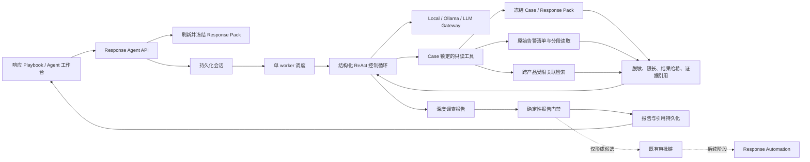
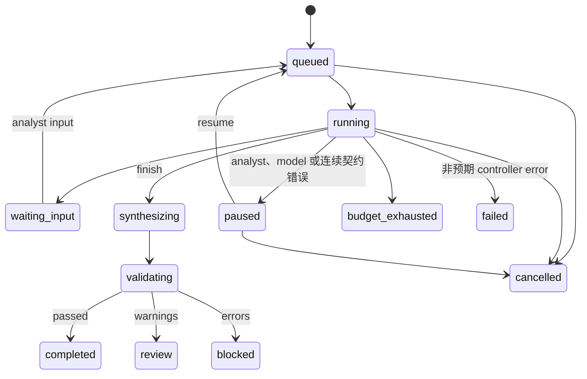

# Defensive AI Response Agent 方案与迭代记录

更新日期：2026-07-29
当前状态：第一阶段 v2 已实现（含受控原始证据与跨产品关联）

## 1. 目标与原则

Response Agent 位于“AI 响应工作台 -> 响应 Playbook”，把一次性静态建议扩展为可暂停、可恢复、可审计的深入调查会话，并最终生成具有完整结论和证据引用的报告。

核心原则：

1. **模型负责规划，控制器负责权限。** LLM 只能从固定工具白名单中选择下一步，不能决定 Case 范围、凭据、网络目标或执行权限。
2. **证据、状态和报告可恢复。** 会话、步骤、工具调用、结果哈希、报告与引用均持久化到 SQLite。
3. **不保存隐式思维链。** 系统只保存简短决策摘要、工具参数、结构化观察和证据引用。
4. **调查与执行分离。** 第一阶段不开放 Shell、任意 HTTP、浏览器、设备连接器或生产处置；响应建议只能是 `observe` 或 `approve_required`。
5. **结论可以是证据不足。** 报告完整性不等于必须判定攻击成立；证据不足本身可以成为最终结论。

### 1.1 本次问题与结论

线上会话 `response_agent_7da2d20a833a418a` 在首轮模型决策后失败，错误为 `ValueError: tool arguments attempted to override controller scope`。根因不是数据库或工具执行失败，而是模型在工具参数中重复返回了当前 `case_id`，旧控制器把“重复且一致的范围”与“尝试切换到其他范围”都视为致命错误。

v2 的处理规则为：

- 与控制器一致的 `case_id`、`session_id` 或源快照哈希会被校验后移除，不再导致失败。
- 与控制器不一致的范围、租户或组织参数仍会拒绝。
- SQL、表名、数据库路径、URL、endpoint、Shell 和 command 在任意嵌套层级均会拒绝。
- 决策或工具契约错误会记录安全错误码并让模型最多修正三次；连续失败后进入可恢复的 `paused`，不再直接落入 `failed`。
- 旧失败会话保留为审计记录；部署新版本后应创建新会话重新调查。

## 2. 第一阶段实现范围

### 2.1 已实现

- Playbook 标题右侧“唤起调查 Agent”入口。
- 桌面端 480px 右侧工作台，移动端全屏工作台。
- 单 Case 同时仅允许一个活跃调查会话。
- 启动时自动检查 Response Pack；缺失或过期时先生成当前版本。
- 冻结标准化 Case 源快照和 Response Pack 制品，并把后续只读 DB 观察按检索时间、结果哈希和证据引用单独记录。
- 查询 Case 关联原始告警清单、字段目录和原始载荷大小。
- 使用 Case 自身实体检索 WAF、EDR、HIPS、RASP、NDR、SIEM 等相关的 normalized 或 raw-only 告警。
- 对已关联或达到相关性门槛的告警，按 RFC 6901 字段和 UTF-8 位元组偏移读取脱敏后的完整原始内容。
- 后台持久化 worker；进程重启后将中断中的任务重新排队。
- `queued -> running -> synthesizing -> validating -> completed/review/blocked` 状态链。
- `waiting_input`、`paused`、`failed`、`cancelled`、`budget_exhausted` 分支。
- 暂停、继续、取消、人工补充信息。
- Gateway/Ollama 的通用结构化 JSON 生成接口。
- 本地规则模型的可复现调查路径，支持离线 Demo 和回归测试。
- 完整报告、确定性报告校验门、引用清单和新证据过期提示。
- Analyst 写权限；read/analyst/approver/responder 读权限。

### 2.2 明确不包含

- 不直接创建或执行生产处置。
- 不调用任意外部 URL、搜索引擎、Shell 或浏览器。
- 不读取设备凭据、密钥或未脱敏载荷；原始日志中的已知敏感字段在进入 LLM 和持久化工具结果前统一脱敏。
- 不接受模型生成的任意 SQL、WHERE 条件、数据库路径或表名。
- 不由模型绕过现有 Validator、审批和 Response Automation。
- 不做多 Agent 自由协作或无限递归规划。

## 3. 运行架构



模型调用和工具查询均在数据库事务之外完成。事务只包围短时间的状态、步骤、工具结果和报告写入，避免远程模型延迟长期占用 SQLite 锁。

## 4. 结构化 ReAct 机制

每一轮模型必须返回一个 JSON 对象：

```json
{
  "action": "tool_call | request_human_input | revise_plan | finish",
  "tool_name": "query_case_snapshot",
  "arguments": {},
  "rationale": "简短的可审计决策摘要",
  "question": "",
  "plan_updates": []
}
```

控制器执行以下校验：

- `action` 必须属于固定枚举。
- `tool_name` 必须属于工具白名单。
- 与服务端固定范围一致的冗余 `case_id/session_id/source_snapshot_hash` 会被校验并移除；任何不一致值均会拒绝。
- 参数不得包含 SQL、表名、数据库路径、URL、endpoint、Shell 或 command。
- 每个工具使用独立参数契约；未知参数被丢弃，数值、列表和游标由控制器归一化和限界。
- 同一工具和参数通过幂等键复用既有结果。
- 模型返回 `finish` 只是综合请求：控制器会先补齐七项基线只读工具；若 manifest 或关联搜索发现原始候选，还必须把至少一条选定原始记录或 `/original_log` 子树读取到 `complete=true`。
- 确定性报告门禁会独立检查上述证据下限；缺少基线工具或原始分段未完成的报告只能进入 `blocked`，不能得到 `passed`。
- 连续重复且没有新观察时强制进入报告综合。
- 达到轮次、工具调用或活动时间预算时进入 `budget_exhausted`。
- 配置下限为 9 轮、8 次工具调用；工具预算只阻止新的工具调用，不阻止已有观察进入报告综合。
- 模型不可用时进入 `paused`，不会静默切换为本地规则结论。
- 连续三次决策或工具契约拒绝后进入 `paused`；错误码、重试状态和审计事件均持久化。

本地 `local-rule-analyst` 按固定顺序执行全部只读工具后综合报告；Gateway/Ollama 由 LLM 每轮选择下一步和调查顺序，但不能绕过控制器证据下限。两条路径使用相同持久化、工具、安全和报告门禁。

## 5. 第一阶段工具白名单

| 工具 | 输入范围 | 输出 | 主要引用 |
|---|---|---|---|
| `query_case_snapshot` | 冻结 Case | Case 基线、最新研判、Validator、Response Pack | event、evidence、response_pack |
| `query_case_evidence` | 冻结 Case | 标准化事件、实体和证据 | event、evidence |
| `query_case_raw_alerts` | 当前 Case 链接 | 原始告警 manifest、大小、源哈希、无值字段目录 | raw_alert |
| `search_related_alerts` | Case 派生实体、产品列表、时间窗 | normalized 与 raw-only 跨产品关联告警 | correlated_raw_alert |
| `read_raw_alert_chunk` | manifest/search 返回的 alert_id、RFC 6901 pointer、位元组游标 | 脱敏 UTF-8 JSON 分段、完整内容哈希、分段哈希 | raw_alert |
| `query_case_timeline` | 冻结 Case | 安全事件、研判、审批与响应时间线 | event、evidence |
| `query_governed_memory` | 当前 Case/产品 | Case active memory、已批准 active product memory | memory |
| `query_response_status` | 冻结 Case | 审批、投票、响应任务、尝试和执行边界 | approval、response_task |

数据库工具不是“给 LLM 一个 SQL 客户端”。控制器只暴露固定 DSL：

- 关联锚点只从当前 Case 已链接的 normalized entities 与 raw payload 中提取，模型不能自行提供 IP、用户、host 或其他查询值。
- 仅提取 allowlist 字段：trace/request ID、IP、host、user、app、process、rule 和 URL。
- 相关性分数至少为 5，避免仅因常见 rule 或 URL 相同就开放原始载荷。
- 搜索同时受时间窗、候选笔数和原始 JSON 总位元组限制；产品参数经过字符 allowlist，并使用参数化 SQL。
- `read_raw_alert_chunk` 会再次计算“已链接或已达到相关性门槛”，不能通过猜测 alert_id 越界读取。

完整原始日志读取采用 manifest + chunk：

1. manifest 仅返回元数据、大小、源哈希和不含字段值的 JSON Pointer 目录；
2. Agent 选择 `/original_log` 或其他必要子树；
3. 控制器在完整对象上先执行深度脱敏，再按 UTF-8 位元组游标分段；默认单段 4096 bytes，保证最新分段能完整进入当前模型 prompt，而不是在工具完成后再次被静默裁剪；
4. `next_offset` 可连续读取到 `complete=true`，避免 prompt 截断导致尾部证据丢失；
5. 每段提供 chunk SHA-256，所有分段共享脱敏后完整内容 SHA-256 与原始来源哈希。

最新原始分段在 planner/report context 中具有最高优先级。模型继续下一段或进入报告前，必须在公开的短 `rationale` 中保留本段事实摘要；控制器把最近 40 条摘要作为滚动调查笔记传入后续轮次和报告综合。这里只保存可审计事实，不保存隐式思维链。若模型在分段尚未完成时请求 `finish`，控制器自动续读 `next_offset`；若原始日志在轮次或工具预算内仍未读到 `complete=true`，会话进入明确的预算终态或报告门禁 `blocked`，不能把未完成读取表述为完整取证。

所有工具结果依次经过：

1. `PolicyEngine.redact()` 深度脱敏；
2. 结构化字节上限裁剪；
3. SHA-256 结果哈希；
4. 引用清单绑定；
5. SQLite 持久化。

证据内容中的提示、命令和 URL 一律按不可信数据处理，不能改变控制器规则。

## 6. 状态模型



Case 进入 `closed` 或 `false_positive` 时，所有活跃调查会话与现有待审批/响应任务一起终止。

## 7. 数据模型

SQLite schema v17 新增：

- `response_agent_sessions`：Case、Response Pack、冻结源快照、目标、计划、预算、用量、模型元数据和状态。
- `response_agent_steps`：顺序化计划、工具决策、观察、人工输入和系统步骤。
- `response_agent_tool_calls`：工具版本、参数、幂等键、结果、结果哈希、引用和错误。
- `response_agent_reports`：版本化内容、源快照哈希、内容哈希、报告门禁和模型元数据。
- `response_agent_report_refs`：报告 claim 到证据、记忆、审批和响应任务的引用映射。

部分唯一索引保证每个 Case 同时只有一个活跃会话。终态会话不会阻止后续基于新证据创建新版本。

SQLite schema v18 新增 `raw_alerts(created_at_ms, alert_id)` 与 `raw_alerts(product, created_at_ms, alert_id)` 索引，为有时间窗和产品过滤的关联扫描提供稳定访问路径。没有新增可由浏览器或模型直接调用的数据库 API。

## 8. API 与权限

读取接口：

```text
GET /api/cases/{case_id}/response-agent/latest
GET /api/response-agent/sessions/{session_id}?after_sequence={n}
```

写接口：

```text
POST /api/cases/{case_id}/response-agent/start
POST /api/response-agent/sessions/{session_id}/pause
POST /api/response-agent/sessions/{session_id}/resume
POST /api/response-agent/sessions/{session_id}/cancel
POST /api/response-agent/sessions/{session_id}/input
```

- GET：`read`、`analyst`、`approver`、`responder`。
- POST：仅 `analyst`。
- Actor 始终取自服务端认证主体；请求体中的伪造 actor 不生效。
- 前端使用 `after_sequence` 增量取得新步骤，同时刷新会话状态、工具元数据、结果哈希和报告；完整工具结果不下发浏览器。
- 工具参数和结果只保存在服务端审计图中；浏览器仅看到安全摘要、哈希与引用，避免原始日志经 UI 扩散。

## 9. 报告与确定性门禁

报告固定包含：

- 执行摘要；
- 分类、置信度、结论、依据和限制；
- `confirmed`、`inferred`、`unverified` 分级发现；
- 攻击链；
- 影响分析；
- 证据缺口；
- 只读或需审批的响应计划；
- 调查工具日志；
- 最终判断；
- 固定执行边界。

报告门禁检查：

- 源快照与 Response Pack 绑定；
- 工具全部来自白名单；
- 引用存在于本次工具观察或 Response Pack；
- 无引用的 confirmed/inferred claim 自动降为 unverified；
- 无直接执行或直接发送能力；
- 响应模式仅为 `observe` 或 `approve_required`；
- 无敏感信息泄漏；
- 继承原 Case Validator 的 `passed/review/blocked` 约束。

门禁结果含错误时为 `blocked`，仅有警告时为 `review`，全部通过时为 `completed`。Case 后续出现新证据不会改写旧报告，而会把会话和报告标记为 stale。

## 10. 配置与运维

```yaml
response_agent:
  enabled: true
  max_turns: 48
  max_tool_calls: 40
  max_wall_seconds: 900
  tool_result_max_bytes: 48000
  correlation_window_minutes: 1440
  correlation_scan_limit: 2000
  correlation_scan_max_bytes: 64000000
  raw_chunk_max_bytes: 4096
```

环境变量：

```text
DEFENSIVE_AI_RESPONSE_AGENT_ENABLED
DEFENSIVE_AI_RESPONSE_AGENT_MAX_TURNS
DEFENSIVE_AI_RESPONSE_AGENT_MAX_TOOL_CALLS
DEFENSIVE_AI_RESPONSE_AGENT_MAX_WALL_SECONDS
DEFENSIVE_AI_RESPONSE_AGENT_TOOL_RESULT_MAX_BYTES
DEFENSIVE_AI_RESPONSE_AGENT_CORRELATION_WINDOW_MINUTES
DEFENSIVE_AI_RESPONSE_AGENT_CORRELATION_SCAN_LIMIT
DEFENSIVE_AI_RESPONSE_AGENT_CORRELATION_SCAN_MAX_BYTES
DEFENSIVE_AI_RESPONSE_AGENT_RAW_CHUNK_MAX_BYTES
```

部署升级必须先做 SQLite 在线备份并执行 `PRAGMA quick_check`。进程启动时会将遗留的 `running/synthesizing/validating` 会话恢复为 `queued`；人工暂停和等待输入状态保持不变。

Agent worker 纳入 `/api/ready` 依赖检查；功能开启但 worker 异常退出时，服务进入 `not_ready`，避免入口健康但调查任务无人消费。

## 11. 后续迭代路线

### 第二阶段：可配置外部只读 Skill

- 引入版本化 Tool/Skill Registry，而不是直接增加自由工具。
- 把第一阶段 v2 的本地 SQLite DSL 作为权限与审计基线。
- 增加受控 CMDB、EDR 查询、SIEM 检索、对象存储归档和威胁情报只读适配器。
- 每个工具声明数据等级、Case scope、网络 allowlist、超时、结果上限和审计字段。
- 增加查询缓存、来源健康度、租户隔离、引用新鲜度和供应商分页游标。
- 验收门：任意工具故障可局部降级；无工具可突破 Case/租户边界。

### 第三阶段：响应候选进入既有审批链

- Agent 只能生成结构化 action candidate。
- 编译器把候选绑定 immutable event、evidence hash、scope、TTL、connector capability 和 rollback。
- Validator `passed` 且能力声明满足时才可创建幂等审批单。
- 不新增旁路执行器，继续复用 `ResponseAutomationService`。
- 验收门：重复提交不重复创建任务；Case 终态、TTL 和误报确认均触发取消或回滚。

### 第四阶段：多角色协作与评测

- Planner、Evidence Reviewer、Response Reviewer 可作为受控角色，而不是自由自治多 Agent。
- 角色共享同一 Case scope 和引用图，不共享隐式思维链。
- 引入离线 Agent Harness：工具选择准确率、引用覆盖率、结论一致性、越权率、成本和延迟。
- 对高风险 Case 支持 analyst checkpoint 和双人复核。
- 验收门：与单 Agent 基线相比，引用完整性和结论质量有可量化提升，越权率保持为零。

## 12. 已知边界

- 第一阶段仅使用本地数据库中的受治理事实；未进入 Gateway/SQLite 的历史遥测仍不可见。
- “完整原始日志”指已存储载荷在策略脱敏后的完整内容，密钥、token、密码等不会提供给模型。
- 关联检索是确定性候选发现，不等同于攻击链确认；报告必须把关联命中与已确认事实分开。
- 默认关联窗为 Case 前后 24 小时，最大 7 天；达到候选或位元组上限时报告必须披露扫描截断。
- SQLite 单 worker 适用于当前单节点 MVP；多副本部署前需迁移到具备租约和并发 claim 的数据库。
- 通用结构化输出不等于模型天然可靠，最终可信边界仍是控制器、证据引用和确定性门禁。
- 报告是内部调查制品，不是生产执行证明，也不是对外沟通已发送证明。
